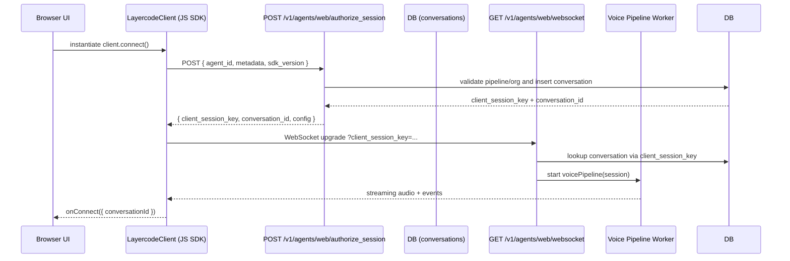
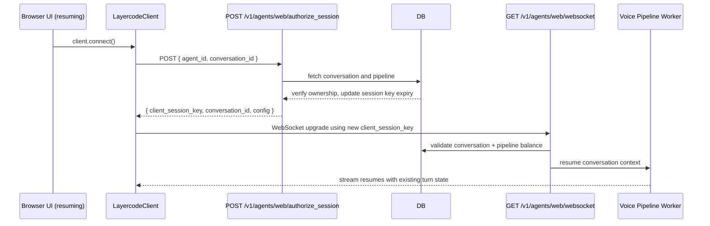
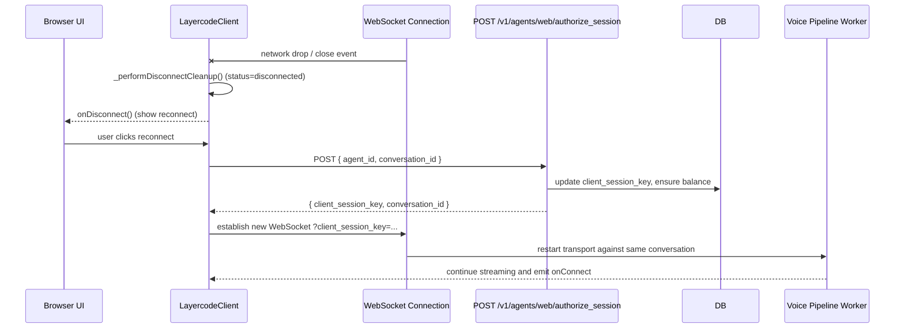

# CLI Reference

Source: https://docs.layercode.com/api-reference/cli

Layercode CLI command reference and usage guide.

## Installation

You’ll need **npm** installed to use the CLI.\
We recommend running commands with `npx` instead of installing globally.

```bash
npx @layercode/cli <command>
```

---

## Commands

### `login`

```bash
npx @layercode/cli login
```

Opens a browser window to log in and link your terminal to your Layercode account.

---

### `init`

```bash
npx @layercode/cli init [--agent <agent_id>]
```

Initializes Layercode locally, creating an example project and linking an agent.

**Flags**

- `--agent <agent_id>`: (optional) Link an existing agent.\
  If not provided, a new agent will be created.

---

### `tunnel`

```bash
$ layercode tunnel [--agent-id <value>] [--path <value>] [--port <value>] [--tail]
```

Runs local project with cloudflared tunnel and updates your agent’s webhook URL in the Layercode dashboard.

**Flags**

- `agent-id=<value>` Specify the unique identifier of the agent. If no agent-id is provided, it will look for an env variable ending with `LAYERCODE_AGENT_ID` from the .env file. If also not found, command will fail.
- `path=<value>` \[default: /api/agent] Set the API path to append for the agent endpoint.
- `port=<value>` \[default: 3000] Port number to run the tunnel on.
- `tail` Continuously stream logs, including CLI messages

**Equivalent to:**

```bash
cloudflared tunnel --url http://localhost:<port_number>
```

---

## Example Usage

```bash
# Log in
npx @layercode/cli login

# Initialize a new local setup
npx @layercode/cli init

# Start a tunnel for agent abc123 on port 5173 with the api found at /api/voice-agent
npx @layercode/cli tunnel --agent=dtv3x3d2 --port=5173 path=/api/voice-agent --tail
```

---

## Troubleshooting

If you encounter issues:

- Ensure **npm** and **Node.js** are installed and up-to-date.
- Try logging out and back in with `npx @layercode/cli login`.
- By default, your tunnel will set your webhook url path as /api/agent. You should update this with the --path flag based on where your webhook endpoint is inside your application e.g. '/api/agent' or at the root '/' or '/voice-agent'. See our guide on [webhooks for more details](/explanations/webhooks)

# Frontend WebSocket API

Source: https://docs.layercode.com/api-reference/frontend-ws-api

Layercode WebSocket API for browser and mobile based voice agent experiences.

The Layercode Frontend WebSocket API is used to create browser and mobile based voice agent experiences. The client browser streams chunks of base64 microphone audio down the WebSocket. In response, the server returns audio chunks of the assistant's response to be played to the user. Additional trigger and data event types allow control of turns and UI updates.

<Note>
  For most use cases, we recommend using our SDKs for React ([React Guide](/tutorials/react)) or Vanilla JS ([Vanilla JS Guide](/tutorials/vanilla_js)). This API reference is
  intended for advanced users who need to implement the WebSocket protocol
  directly.
</Note>

# Connecting to the WebSocket

The client browser connects to the Layercode WebSocket API at the following URL:

```
wss://api.layercode.com/v1/agents/web/websocket
```

## Authorizing the WebSocket Connection

When establishing the WebSocket connection, the following query parameter must be included in the request URL:

- `client_session_key`: A unique session key obtained from the Layercode REST API `/authorize` endpoint.

Example full connection URL:

```
wss://api.layercode.com/v1/agents/web/websocket?client_session_key=your_client_session_key
```

To obtain a client_session_key, you must first create a new session for the user by calling the [Layercode REST API /authorize](/api-reference/rest-api#authorize) endpoint. This endpoint returns a client_session_key which must be included in the WebSocket connection parameters. This API call should be made from your backend server, not the client browser. This ensures your LAYERCODE_API_KEY is never exposed to the client, and allows you to do any additional user authorization checks required by your application.

# WebSocket Events

## Client → Server Messages

### Client Ready

When the client has established the WebSocket connection and is ready to begin streaming audio, it should send a ready message:

```json
{ "type": "client.ready" }
```

### Audio Streaming

At WebSocket connection, the client should constantly send audio chunks of the user's microphone in the format below. The content must be the following format:

- Base64 encoded
- 16-bit PCM audio data
- 8000 Hz sample rate
- Mono channel

See the [Vanilla JS SDK code](https://github.com/layercodedev/packages-and-docs/tree/main/packages/layercode-js-sdk/src) for an example of how browser microphone audio is correctly encoded to base64.

```json
{ "type": "client.audio", "content": "base64audio" }
```

### Voice Activity Detection Events

The client can send Voice Activity Detection (VAD) events to inform the server about speech detection. This will improve the speed and accuracy of automatic turn taking:

VAD detects voice activity:
Note: The client is responsible for stopping any in-progress assistant audio playback when the user interrupts.

```json
{
  "type": "vad_events",
  "event": "vad_start"
}
```

Detected voice activity ends:

```json
{
  "type": "vad_events",
  "event": "vad_end"
}
```

Client could not load the VAD model, so VAD events won't be sent:

```json
{
  "type": "vad_events",
  "event": "vad_model_failed"
}
```

### Response Audio Replay Finished

The client will receive audio chunks of the assistant's response (see [Audio Response](#audio-response)). When the client has finished replaying all assistant audio chunks in its buffer it must reply with 'client.response_audio_replay_finished' Note that the assistant webhook can return response.tts events (which are turned into speech and received by the client as response.audio events) at any point during a long response (in between other text or json events), so the client must handle situations where it's played all the audio in the buffer, but then receives more to play. This will result in the client sending multiple 'trigger.response.audio.replay_finished' completed events over a single turn.

```json
{
  "type": "trigger.response.audio.replay_finished",
  "reason": "completed",
  "turn_id": "UUID of assistant response"
}
```

### Push-to-Talk Control (Optional)

In push-to-talk mode (read more about [Turn Taking](/explanations/turn-taking)), the client must send the following events to start and end a user turn to speak. This is typically connected to a button which is held down for the user to speak. In this mode, the client can also preemptively halt the assistant's audio playback when the user interrupts. Instead of waiting to receive a `turn.strat` event (which indicates a turn change), send a `trigger.audio.replay_finished` event when the user interrupts the assistant.

Start user turn (user has pressed the button):

```json
{ "type": "trigger.turn.start", "role": "user" }
```

End user turn (user has released the button):

```json
{ "type": "trigger.turn.end", "role": "user" }
```

### Send Text Messages (Optional)

To enable your users to sent text messages (as an alternative to voice), send a text user message from your frontend in the `client.response.text` event. Layercode will send the user text message to your agent backend in the same format as a regular user transcript message.

```json
{
  "type": "client.response.text",
  "content": "Text input from the user"
}
```

- `content`: The full user message. Empty or whitespace-only payloads are ignored.

## Server → Client Messages

The client will receive the following events from Layercode:

### Turn Management

When the server detects the start of the user's turn:

```json
{ "type": "turn.start", "role": "user", "turn_id": "UUID of user turn" }
```

When it's the assistant's turn:

```json
{ "type": "turn.start", "role": "assistant", "turn_id": "UUID of assistant turn" }
```

### Audio Response

The client will receive audio chunks of the assistant's response, which should be buffered and played immediately.

The content will be audio in the following format:

- Base64 encoded
- 16-bit PCM audio data
- 16000 Hz sample rate
- Mono channel

See the [Vanilla JS SDK code](https://github.com/layercodedev/packages-and-docs/tree/main/packages/layercode-js-sdk/src) for an example of how to play the audio chunks.

```json
{
  "type": "response.audio",
  "content": "base64audio",
  "delta_id": "UUID unique to each delta msg",
  "turn_id": "UUID of assistant response turn"
}
```

### Text Response

The client will receive text chunks of the assistant's response for display or processing:

```json
{
  "type": "response.text",
  "content": "Text content from assistant",
  "turn_id": "UUID of assistant response turn"
}
```

### User Transcript Updates

Layercode streams back transcription updates for the user's speech so you can render the live transcript in your UI.

#### Interim Transcript Delta

Interim updates refine the current transcript in place as the speech recognizer gains confidence. Each `user.transcript.interim_delta` replaces the previous one (with a matching delta_counter) until a `user.transcript.delta` arrives (with a matching delta_counter). Subsequent `user.transcript.interim_delta` will have an incremented delta_counter and should now be appended to the previous finalized `user.transcript.delta` text.

```json
{
  "type": "user.transcript.interim_delta",
  "content": "Partial user text",
  "turn_id": "user-UUID of the speaking turn",
  "delta_counter": 6
}
```

- `content`: Latest partial text heard for the in-progress user utterance.
- `turn_id`: The user turn identifier (prefixed with the role for clarity).
- `delta_counter`: Monotonic counter forwarded from the underlying transcription `delta.counter` to help you discard out-of-order updates.

#### Transcript Delta

Once the recognizer finalizes a span of text, it is emitted as a `user.transcript.delta`. Any subsequent `user.transcript.interim_delta` start a new span until the next finalized delta arrives.

```json
{
  "type": "user.transcript.delta",
  "content": "Stabilized transcript segment",
  "turn_id": "user-UUID of the speaking turn",
  "delta_counter": 6
}
```

- `content`: Stabilized transcript segment that should replace the previous interim text.
- `turn_id`: The user turn identifier (prefixed with the role for clarity).
- `delta_counter`: Monotonic counter forwarded from the underlying transcription `delta.counter` so you can detect missed or out-of-order deltas.

\#### Final Transcript

One the user's turn has deemed completed a final transcript is emitted. This contains the full text of the user's turn.

```json
{
  "type": "user.transcript",
  "content": "Complete transcript of user turn",
  "turn_id": "user-UUID of the speaking turn"
}
```

### Data and State Updates

Your Webhook can return response.data SSE events, which will be forwarded to the browser client. This is ideal for updating UI and state in the browser. If you want to pass text or json deltas instead of full objects, you can simply pass a json object like `{ "delta": "text delta..." }` and accumulate and render the delta in the client browser.

```json
{
  "type": "response.data",
  "content": { "json": "object" },
  "turn_id": "UUID of assistant response"
}
```

# Introduction

Source: https://docs.layercode.com/api-reference/introduction

Layercode API Reference

- **[Frontend WebSocket API](/api-reference/frontend-ws-api) (for building web and mobile voice AI applications):** Enables seamless connection between your frontend applications and Layercode's real-time agents. Use this API with our Frontend SDKs to stream audio and receive responses.
- **[Webhook SSE API](/api-reference/webhook-sse-api) (for connecting your own backend to Layercode):** This is a webhook endpoint you implement in your backend, to receive transcriptions from the user, then respond with SSE messages containing text to be converted to speech and spoken to the user.

# REST API

Source: https://docs.layercode.com/api-reference/rest-api

API reference for the Layercode REST API.

## Authorize Client Session

To connect a client (browser or mobile app) to a Layercode voice agent, you must first authorize the session. This is done by calling the Layercode REST API endpoint below from your backend.

**How the authorization flow works:**
When using a Layercode frontend SDK (such as `@layercode/react-sdk` or `@layercode/js-sdk`), the SDK will automatically make a POST request to the `authorizeSessionEndpoint` URL that you specify in your frontend code.

This `authorizeSessionEndpoint` should be an endpoint on **your own backend** (not Layercode's). Your backend receives this request from the frontend, then securely calls the Layercode REST API (`https://api.layercode.com/v1/agents/web/authorize_session`) using your `LAYERCODE_API_KEY`. Your backend then returns the `client_session_key` to the frontend.

<Warning>
  Scheduled change: Monday 1 September at 12:00 UTC — the response body will return <code>conversation\_id</code> instead of <code>session\_id</code>. Until then, you will continue to receive <code>session\_id</code>. Plan your upgrade accordingly.
</Warning>

<Info>
  Your Layercode API key should <b>never</b> be exposed to the frontend. Always call this endpoint from your backend, then return the <code>client\_session\_key</code> to your
  frontend.
</Info>

### Endpoint

```http
POST https://api.layercode.com/v1/agents/web/authorize_session
```

### Headers

<ParamField header="Authorization" type="string" required>
  Bearer token using your <code>LAYERCODE\_API\_KEY</code>.
</ParamField>

<ParamField header="Content-Type" type="string" required default="application/json">
  Must be <code>application/json</code>.
</ParamField>

### Request Body

<ParamField body="agent_id" type="string" required>
  The ID of the Layercode agent the client should connect to.
</ParamField>

<ParamField body="conversation_id" type="string">
  (Optional) The conversation ID to resume an existing conversation. If not provided, a new conversation will be created.
</ParamField>

### Response

<ResponseField name="client_session_key" type="string" required>
  The key your frontend uses to connect to the Layercode WebSocket API.
</ResponseField>

<ResponseField name="conversation_id" type="string" required>
  The unique conversation ID.
</ResponseField>

<ResponseField name="config" type="object">
  Optional configuration for this session used by the frontend SDK. When present, it can include:

  <br />

<code>transcription.trigger</code>, <code>transcription.automatic</code>, <code>transcription.can_interrupt</code>, and VAD settings such as <code>vad.enabled</code>, <code>vad.gate_audio</code>, <code>vad.buffer_frames</code>, <code>vad.model</code>, <code>vad.positive_speech_threshold</code>, <code>vad.negative_speech_threshold</code>, <code>vad.redemption_frames</code>, <code>vad.min_speech_frames</code>, <code>vad.pre_speech_pad_frames</code>, <code>vad.frame_samples</code>.
</ResponseField>

### Example Request

```bash
# Example with only agent_id (creates a new session)
curl -X POST https://api.layercode.com/v1/agents/web/authorize_session \
  -H "Authorization: Bearer $LAYERCODE_API_KEY" \
  -H "Content-Type: application/json" \
  -d '{"agent_id": "ag-123456"}'

# Example with agent_id and conversation_id (resumes an existing conversation)
curl -X POST https://api.layercode.com/v1/agents/web/authorize_session \
  -H "Authorization: Bearer $LAYERCODE_API_KEY" \
  -H "Content-Type: application/json" \
  -d '{"agent_id": "ag-123456", "conversation_id": "lc_conv_abc123..."}'
```

### Example Response

```json
{
  "client_session_key": "lc_sesskey_abc123...",
  "conversation_id": "lc_conv_abc123..."
}
```

### Error Responses

<ResponseField name="error" type="string" required>
  Error message describing the problem.
</ResponseField>

**Possible error cases:**

- `400` – Invalid or missing bearer token, invalid agent ID, missing or invalid conversation ID.
- `402` – Insufficient balance for the organization.

**Example error response:**

```json
{
  "error": "insufficient balance"
}
```

### Example: Backend Endpoint (Next.js)

Here's how you might implement an authorization endpoint in your backend (Next.js example):

```ts Next.js app/api/authorize/route.ts [expandable]
export const dynamic = 'force-dynamic';
import { NextResponse } from 'next/server';

export const POST = async (request: Request) => {
  // Here you could do any user authorization checks you need for your app
  const endpoint = 'https://api.layercode.com/v1/agents/web/authorize_session';
  const apiKey = process.env.LAYERCODE_API_KEY;
  if (!apiKey) {
    throw new Error('LAYERCODE_API_KEY is not set.');
  }
  const requestBody = await request.json();
  if (!requestBody || !requestBody.agent_id) {
    throw new Error('Missing agent_id in request body.');
  }
  try {
    const response = await fetch(endpoint, {
      method: 'POST',
      headers: {
        'Content-Type': 'application/json',
        Authorization: `Bearer ${apiKey}`
      },
      body: JSON.stringify(requestBody)
    });
    if (!response.ok) {
      const text = await response.text();
      throw new Error(text || response.statusText);
    }
    return NextResponse.json(await response.json());
  } catch (error: any) {
    console.log('Layercode authorize session response error:', error.message);
    return NextResponse.json({ error: error.message }, { status: 500 });
  }
};
```

<Info>
  For other backend frameworks (Express, FastAPI, etc.), the logic is the same: receive a request from your frontend, call the Layercode <code>authorize\_session</code> endpoint
  with your API key, and return the <code>client\_session\_key</code> to your frontend.
</Info>

## Agents

### List Agents

```http
GET https://api.layercode.com/v1/agents
```

<ParamField header="Authorization" type="string" required>
  Bearer token using your <code>LAYERCODE\_API\_KEY</code>.
</ParamField>

#### Response

Returns all agents.

<ResponseField name="agents" type="array" required>
  Each agent object includes <code>id</code>, <code>name</code>, <code>type</code>, <code>agent\_template\_id</code>, <code>created\_at</code>, <code>updated\_at</code>, and <code>assigned\_phone\_numbers</code> (array of phone number assignments with <code>phone\_number</code>, <code>twilio\_sid</code>, <code>friendly\_name</code>, <code>assigned\_at</code>).
</ResponseField>

#### Example

```bash
curl -H "Authorization: Bearer $LAYERCODE_API_KEY" \
  https://api.layercode.com/v1/agents
```

```json
{
  "agents": [
    {
      "id": "ag-123456",
      "name": "My Agent ag-123456",
      "type": "voice",
      "agent_template_id": "tmpl_default",
      "created_at": "2024-04-01T12:00:00.000Z",
      "updated_at": "2024-04-08T16:30:16.000Z",
      "assigned_phone_numbers": [
        {
          "phone_number": "+15551234567",
          "twilio_sid": "PNxxxxxxxxxxxxxxxxxxxxxxxxxxxxxxxx",
          "friendly_name": "Support Line",
          "assigned_at": "2024-04-02T09:21:00.000Z"
        }
      ]
    }
  ]
}
```

### Create Agent From Template

```http
POST https://api.layercode.com/v1/agents
```

<ParamField header="Authorization" type="string" required>
  Bearer token using your <code>LAYERCODE\_API\_KEY</code>.
</ParamField>

<ParamField header="Content-Type" type="string" required default="application/json">
  Must be <code>application/json</code>.
</ParamField>

<ParamField body="template_id" type="string">
  Optional template ID to initialize the agent configuration. If omitted, the default recommended template is used.
</ParamField>

#### Response

Returns the newly created agent record, including configuration and webhook secret.

<ResponseField name="id" type="string" required>Unique identifier for the agent.</ResponseField>
<ResponseField name="name" type="string" required>Human-friendly name assigned by Layercode.</ResponseField>
<ResponseField name="type" type="string" required>Agent type (currently <code>voice</code>).</ResponseField>
<ResponseField name="config" type="object" required>Full pipeline configuration cloned from the template.</ResponseField>
<ResponseField name="webhook_secret" type="string" required>Secret used to validate incoming webhooks.</ResponseField>
<ResponseField name="agent_template_id" type="string" required>ID of the template used to create the agent.</ResponseField>

```bash
curl -X POST https://api.layercode.com/v1/agents \
  -H "Authorization: Bearer $LAYERCODE_API_KEY" \
  -H "Content-Type: application/json" \
  -d '{ "template_id": "tmpl_sales" }'
```

### Get Agent Details

```http
GET https://api.layercode.com/v1/agents/{agent_id}
```

<ParamField header="Authorization" type="string" required>
  Bearer token using your <code>LAYERCODE\_API\_KEY</code>.
</ParamField>

<ParamField pathParam="agent_id" type="string" required>
  The ID of the agent.
</ParamField>

#### Response

Returns the agent.

<ResponseField name="id" type="string" required>Agent ID.</ResponseField>
<ResponseField name="name" type="string" required>Agent display name.</ResponseField>
<ResponseField name="config" type="object" required>Current pipeline configuration.</ResponseField>
<ResponseField name="assigned_phone_numbers" type="array">Array of phone number assignments for this agent.</ResponseField>

```bash
curl -H "Authorization: Bearer $LAYERCODE_API_KEY" \
  https://api.layercode.com/v1/agents/ag-123456
```

### Update Agent Configuration

```http
POST https://api.layercode.com/v1/agents/{agent_id}
```

<ParamField header="Authorization" type="string" required>
  Bearer token using your <code>LAYERCODE\_API\_KEY</code>.
</ParamField>

<ParamField header="Content-Type" type="string" required default="application/json">
  Must be <code>application/json</code>.
</ParamField>

<ParamField pathParam="agent_id" type="string" required>
  The ID of the agent to update.
</ParamField>

<ParamField body="webhook_url" type="string">
  URL for production webhooks. When provided, <code>demo\_mode</code> is automatically disabled.
</ParamField>

#### Response

Returns the updated agent record with the new configuration.

```bash
curl -X POST https://api.layercode.com/v1/agents/ag-123456 \
  -H "Authorization: Bearer $LAYERCODE_API_KEY" \
  -H "Content-Type: application/json" \
  -d '{
    "webhook_url": "https://example.com/layercode-webhook"
  }'
```

## Sessions

### Get Session Details

```http
GET https://api.layercode.com/v1/agents/{agent_id}/sessions/{session_id}
```

<ParamField header="Authorization" type="string" required>
  Bearer token using your <code>LAYERCODE\_API\_KEY</code>.
</ParamField>

<ParamField pathParam="agent_id" type="string" required>
  The ID of the agent.
</ParamField>

<ParamField pathParam="session_id" type="string" required>
  The connection ID for the session. This is the unique connection identifier for a given session.
</ParamField>

#### Response

Returns JSON with details about the session, transcript, and recording status.

<ResponseField name="session_id" type="string" required>Connection ID for the session.</ResponseField>
<ResponseField name="agent_id" type="string" required>ID of the agent.</ResponseField>
<ResponseField name="started_at" type="string">ISO timestamp when the connection started.</ResponseField>
<ResponseField name="ended_at" type="string">ISO timestamp when the connection ended (if ended).</ResponseField>
<ResponseField name="duration_ms" type="number">Total connection duration in milliseconds.</ResponseField>
<ResponseField name="metadata" type="object">Custom metadata associated with the session.</ResponseField>
<ResponseField name="from_phone_number" type="string">Caller phone number (Twilio), if applicable.</ResponseField>
<ResponseField name="from_phone_country" type="string">Caller country code (Twilio), if applicable.</ResponseField>
<ResponseField name="to_phone_number" type="string">Agent phone number (Twilio), if applicable.</ResponseField>
<ResponseField name="to_phone_country" type="string">Agent phone number country code (Twilio), if applicable.</ResponseField>
<ResponseField name="ip_address" type="string">IP address of the connection.</ResponseField>
<ResponseField name="country_code" type="string">Country code derived from IP address when available.</ResponseField>
<ResponseField name="transcription_duration_seconds" type="number">Total seconds of user speech.</ResponseField>
<ResponseField name="tts_duration_seconds" type="number">Total seconds of generated speech.</ResponseField>
<ResponseField name="latency_ms" type="number">Processing latency in milliseconds.</ResponseField>

<ResponseField name="transcript" type="array">
  Array of transcript entries. Each entry includes: <code>timestamp</code>, <code>user\_message</code>, <code>assistant\_message</code>, <code>latency\_ms</code>.
</ResponseField>

<ResponseField name="recording_status" type="string">
  One of <code>not\_available</code>, <code>in\_progress</code>, <code>completed</code>.
</ResponseField>

<ResponseField name="recording_url" type="string">
  If <code>recording\_status</code> is <code>completed</code>, a URL to download the WAV recording for this session connection.
</ResponseField>

#### Example

```bash
curl -H "Authorization: Bearer $LAYERCODE_API_KEY" \
  https://api.layercode.com/v1/agents/ag-123456/sessions/lc_conn_abc123
```

### Download Session Recording

```http
GET https://api.layercode.com/v1/agents/{agent_id}/sessions/{session_id}/recording
```

<ParamField header="Authorization" type="string" required>
  Bearer token using your <code>LAYERCODE\_API\_KEY</code>.
</ParamField>

<ParamField pathParam="agent_id" type="string" required>
  The ID of the agent.
</ParamField>

<ParamField pathParam="session_id" type="string" required>
  The connection ID for the session.
</ParamField>

Returns a WAV audio file if available.

```bash
curl -L -H "Authorization: Bearer $LAYERCODE_API_KEY" \
  -o session.wav \
  https://api.layercode.com/v1/agents/ag-123456/sessions/lc_conn_abc123/recording
```

<Note>
  Recordings are generated after a session completes. If a recording is still processing, the details endpoint will return <code>recording\_status: "in\_progress"</code>.
</Note>

<Check>
  Once your frontend receives the <code>client\_session\_key</code>, it can connect to the Layercode WebSocket API to start streaming audio.
</Check>

## Calls

### Initiate Outbound Call

```http
POST https://api.layercode.com/v1/agents/ag-123456/calls/initiate_outbound
```

<ParamField body="from_phone_number" type="string" required>
  The phone number assigned to your Layercode Agent that will make the call.
</ParamField>

<Note>
  Remember: the from\_phone\_number must be a number already assigned to your Laycode Agent in the dashboard.
</Note>

<ParamField body="to_phone_number" type="string" required>
  The phone number to call (e.g., your mobile number for testing).
</ParamField>

#### Response

<ResponseField name="conversation_id" type="string" required>
  The unique conversation ID.
</ResponseField>

<Note>
  A Session (associated with the returned conversation\_id) will be created shortly after once Twilio initiates the call)
</Note>

#### Example Request

```bash
  curl -X POST https://api.layercode.com/v1/agents/ag-123456/calls/initiate_outbound \
  -H 'Authorization: Bearer $LAYERCODE_API_KEY' \
  -H 'Content-Type: application/json' \
  -D '{
      "from_phone_number": "NUMBER_ASSIGNED_TO_YOUR_AGENT",
      "to_phone_number": "PHONE_NUMBER_TO_CALL"
  }'
```

#### Example Response

```json
{
  "conversation_id": "lc_conv_abc123..."
}
```

#### Error Responses

<ResponseField name="error" type="string" required>
  Error message describing the problem.
</ResponseField>

**Possible error cases:**

- `400` – Invalid or missing bearer token, missing or request body, invalid from_phone_number (i.e. not assigned to the agent specified in the url).
- `429` – Account session concurrency limit reached.
- `402` – Insufficient balance for the organization.

## Twilio Voice

### TwiML Webhook

Use this endpoint as the Voice webhook in your Twilio phone number configuration. Layercode validates the incoming request, authorizes a session, and returns TwiML that connects the call to your agent's WebSocket stream.

```http
POST https://api.layercode.com/v1/agents/twilio/twiml
```

<ParamField header="X-Twilio-Signature" type="string">
  Signature supplied by Twilio for request verification. Required when you have stored Twilio credentials in Layercode.
</ParamField>

<ParamField body="Direction" type="string" required>
  Call direction reported by Twilio (e.g., <code>inbound</code> or <code>outbound-api</code>).
</ParamField>

<ParamField body="From" type="string" required>
  Caller phone number.
</ParamField>

<ParamField body="FromCountry" type="string">
  Caller country code supplied by Twilio.
</ParamField>

<ParamField body="To" type="string" required>
  Phone number assigned to your agent.
</ParamField>

<ParamField body="ToCountry" type="string">
  Destination country code supplied by Twilio.
</ParamField>

#### Response

Returns TwiML that streams the call to the Layercode Twilio WebSocket endpoint.

```xml
<?xml version="1.0" encoding="UTF-8"?>
<Response>
  <Connect>
    <Stream url="wss://twilio.layercode.com/v1/agents/twilio/websocket/{client_session_key}" />
  </Connect>
</Response>
```

<Info>
  The response Streaming URL is generated dynamically for each request. Do not cache or reuse the client session key.
</Info>

# Webhook SSE API

Source: https://docs.layercode.com/api-reference/webhook-sse-api

Webhook SSE API

## Webhook Request Payload

Layercode sends different webhook event types to your backend. Each request body is JSON. All requests include:

- `type` (string): One of `message`, `session.start`, `session.end`, `session.update`.
- `session_id` (string): Connection identifier for this session. Changes each reconnect.
- `conversation_id` (string): Stable conversation identifier.

Additional fields vary by event type, as described below.

---

### **message**

- `text` (string): Transcribed user text.
- `session_id` (string): A unique identifier for the current session.
- `conversation_id` (string): A unique identifier for the conversation.
- `turn_id` (string): Unique ID for this turn.
- `from_phone_number` (string, optional): Caller phone number if Twilio is used.
- `to_phone_number` (string, optional): Agent phone number if Twilio is used.

**Example:**

```json
{
  "type": "message",
  "session_id": "sess_abc123",
  "conversation_id": "conv_xyz789",
  "turn_id": "turn_xyz123",
  "text": "Hello, how are you?",
  "from_phone_number": "+14155550123",
  "to_phone_number": "+14155559876"
}
```

---

### **session.start**

Sent when a new session begins and your agent should optionally speak first.

- `session_id` (string): A unique identifier for the current session.
- `conversation_id` (string): A unique identifier for the conversation.
- `turn_id` (string): Unique ID for the assistant welcome turn.
- `from_phone_number` (string, optional): Caller phone number if Twilio is used.
- `to_phone_number` (string, optional): Agent phone number if Twilio is used.

**Example:**

```json
{
  "type": "session.start",
  "session_id": "sess_abc123",
  "conversation_id": "conv_xyz789",
  "turn_id": "turn_welcome_123",
  "from_phone_number": "+14155550123",
  "to_phone_number": "+14155559876"
}
```

---

### **session.update**

Sent when asynchronous session data becomes available (e.g., after a recording completes).

- `session_id` (string): A unique identifier for the current session.
- `conversation_id` (string): A unique identifier for the conversation.
- `recording_status` (string): `completed` or `failed`.
- `recording_url` (string, optional): API URL to download WAV when `completed`.
- `recording_duration` (number, optional): Duration in seconds.
- `error_message` (string, optional): Error details when `failed`.
- `metadata` (object): Session metadata originally provided during authorization (if any).
- `from_phone_number` (string, optional): Caller phone number if Twilio is used.
- `to_phone_number` (string, optional): Agent phone number if Twilio is used.

**Example:**

```json
{
  "type": "session.update",
  "session_id": "sess_abc123",
  "conversation_id": "conv_xyz789",
  "from_phone_number": "+14155550123",
  "to_phone_number": "+14155559876",
  "recording_status": "completed",
  "recording_url": "https://api.layercode.com/v1/agents/ag_123/sessions/sess_abc123/recording",
  "recording_duration": 42.3,
  "metadata": { "userId": "u_123" }
}
```

---

### **session.end**

Sent when the session finishes. Includes transcript and usage metrics.

- `session_id` (string): A unique identifier for the current session.
- `conversation_id` (string): A unique identifier for the conversation.
- `agent_id` (string): Agent ID.
- `started_at` / `ended_at` (string): ISO timestamps.
- `duration` (number|null): Total milliseconds (if available).
- `transcription_duration_seconds` (number|null)
- `tts_duration_seconds` (number|null)
- `latency` (number|null)
- `ip_address` (string|null)
- `country_code` (string|null)
- `recording_status` (string): `enabled` or `disabled` (org setting for session recording).
- `transcript` (array): Items of `{ role: 'user' | 'assistant', text: string, timestamp: number }`.
- `from_phone_number` (string, optional): Caller phone number if Twilio is used.
- `to_phone_number` (string, optional): Agent phone number if Twilio is used.

**Example:**

```json
{
  "type": "session.end",
  "session_id": "sess_abc123",
  "conversation_id": "conv_xyz789",
  "agent_id": "ag_123",
  "from_phone_number": "+14155550123",
  "to_phone_number": "+14155559876",
  "started_at": "2025-08-28T10:00:00.000Z",
  "ended_at": "2025-08-28T10:03:00.000Z",
  "duration": 180000,
  "transcription_duration_seconds": 20.1,
  "tts_duration_seconds": 19.8,
  "latency": 120,
  "ip_address": "203.0.113.10",
  "country_code": "US",
  "recording_status": "enabled",
  "transcript": [
    { "role": "user", "text": "Hello", "timestamp": 1724848800000 },
    { "role": "assistant", "text": "Hi there!", "timestamp": 1724848805000 }
  ]
}
```

# Configure your voice agents

Source: https://docs.layercode.com/explanations/configuring-voice-agents

Key concepts and options for configuring transcription, TTS, and backend in a Layercode agent.

Use this page to choose transcription, text-to-speech (TTS), and backend settings for your agent.

## Transcription

Transcription converts user speech to text.

- Provider and model: match your language and latency needs.
- Turn taking: automatic or push to talk. See [Turn taking](/explanations/turn-taking).
- Interrupts (automatic mode): let users speak over the agent.

## Text-to-Speech (TTS)

TTS converts the agent's text response to audio.

- Provider and model: balance speed and quality.
- Voice: choose one that fits your brand and language.

## Practical tips

- Start with defaults and optimize after you have an end-to-end demo.
- Prefer low-latency models for real-time conversations.
- If using your own backend, test locally with a tunnel. See [Tunnelling](/how-tos/tunnelling).

## Where to change settings

In the dashboard, open your agent and click **Edit** on Transcription, Text-to-Speech, or Backend. Changes apply immediately to new turns.

# Connect Your Backend

Source: https://docs.layercode.com/explanations/connect-backend

How to connect your own agent backend to a Layercode agent.

Layercode is designed for maximum flexibility: you can connect any backend that can receive an HTTP request and return a Server-Sent Events (SSE) stream.
This allows you to use your own LLM-powered agent, business logic, or orchestration—while Layercode handles all the real-time voice infrastructure.

## How it works

To use your own backend, click the "Connect Your Backend" button on your agent, and then set the **Webhook URL** to point to your backend's endpoint.


When a user interacts with your voice agent, Layercode will:

1. Transcribe the user's speech to text.
2. Send an HTTP POST request to your backend at the Webhook URL you provide.
3. Your backend responds with a Server-Sent Events (SSE) stream containing the agent's reply (text to be spoken, and optional data).
4. Layercode handles converting the text in your response to speech and streaming it back to the user in real time.
5. Return of JSON data is also supported to allow you to pass state back to your UI.


## Configuring Your Agent

1. In the Layercode dashboard, open your agent and click **Connect Your Backend** (or click the edit button in the Your Backend box if you've already connected your backend previously).
2. Enter your backend's **Webhook URL** in the configuration modal.
3. Optionally, configure which webhook events you want to receive (see below).
4. Save your changes.

## Webhook Events

- **message** (required):\
  Sent when the user finishes speaking. Contains the transcribed message and metadata. Your backend should respond with an SSE stream containing the agent's reply.
- **session.start** (optional):\
  Sent when a new session is started (e.g., when a user connects). Use this to have your agent start the conversation. If disabled, the agent will wait for the user to speak first when a new session is started.

## Webhook Verification

To ensure the security of your backend, it's crucial to verify that incoming requests are indeed from Layercode. This can be done by verifying the `layercode-signature` header, which contains a timestamp and a HMAC-SHA256 signature of the request body.

Here's how you can verify the signature in your backend:

1. Retrieve the `layercode-signature` header from the request. It will be in the format: `t=timestamp,v1=signature`.
2. Get your Layercode webhook secret from the Layercode dashboard (found by going to the appropriate agent and clicking the edit button in the Your Backend box, where you'll find the Webhook Secret).
3. Reconstruct the signed payload by concatenating the timestamp, a period (`.`), and the exact raw webhook request body: `signed_payload = timestamp + "." + request_body`.
4. Compute the HMAC-SHA256 signature of this signed payload using your webhook secret.
5. Compare the computed signature with the `v1` value from the `layercode-signature` header. If they match, the request is valid.
6. (Recommended) Check that the timestamp is recent (for example, within 5 minutes) to prevent replay attacks.

## Example: Webhook Request

When a user finishes speaking, Layercode will send a POST request to your webhook with the following JSON payload body:

```json
{
  "type": "message", // The type of webhook event: message or session.start
  "session_id": "uuid", // Session ID is unique per conversation. Use this to know which conversation a webhook belongs to.
  "turn_id": "uuid", // Turn ID is unique per turn of the conversation. This ID must be returned in all SSE events. It is unique per turn of the conversation.
  "text": "What's the weather today?" // The user's transcribed message
}
```

See the [Webhook SSE API documentation](/api-reference/webhook-sse-api) for details

## Example: SSE Response

Your backend should respond with an SSE stream. Each SSE message contains a JSON payload with the following fields: `type`, `content` (when required) and `turn_id`. See the [Webhook SSE API documentation](/api-reference/webhook-sse-api) for details.

# Keeping track of conversation history

Source: https://docs.layercode.com/explanations/conversation-history

How to persist turn-by-turn context when webhook requests can abort

Tracking conversation history seems easy. But there is one big gotcha - webhook requests can abort.

And it's common in voice because of interruptions.

And so we need to adjust our approach.

Let's start naively. A user sends a message, so we add it to an array.

```json
[{ "role": "user", "turn_id": "turn-1", "content": "Hey, how do I make a hot dog?" }]
```

And then when the assistant replies, we simply append it:

```json
[
  { "role": "user", "turn_id": "turn-1", "content": "Hey, how do I make a hot dog?" },
  { "role": "assistant", "turn_id": "turn-2", "content": "You put the frankfurter in the bun and add some mustard." }
]
```

### But what if the user interrupts?

When the user interrupts mid-response, the **webhook request that was generating the assistant’s reply is abruptly terminated**.\
Unless we’ve already written something to memory, the assistant’s partial message could be lost.

In practice, this happens a lot with voice agents — users cut off the model to ask something new before the previous response finishes.\
If we don’t handle this carefully, our in-memory state drifts out of sync with what actually happened in the conversation.

And you might not even realize, and think the LLM is just being a silly billy.

---

## So what do I need to do?

When a new user webhook arrives, persist in this order:

1. **Store the user message** right away so the turn is anchored in history.
2. **Insert the assistant placeholder** before you start streaming tokens back.

```ts
conversationMessages[conversation_id].push({
  role: 'user',
  turn_id,
  content: userInput
});
```

```ts
conversationMessages[conversation_id].push({
  role: 'assistant',
  turn_id,
  content: '' // placeholder
});
```

If the webhook completes successfully:

- Remove the placeholder and append final messages with the same `turn_id`.

If the webhook is aborted:

- The placeholder remains, capturing the interrupted turn.
- The next `message` webhook includes `interruption_context`, which tells us which `assistant_turn_id` was cut off.
- You can reconcile by marking that entry as interrupted.

### Example Interruption Handling

```ts
if (interruption_context?.assistant_turn_id) {
  const prev = conversationMessages[conversation_id];
  const interrupted = prev.find((m) => m.role === 'assistant' && m.turn_id === interruption_context.assistant_turn_id);
  if (interrupted) {
    interrupted.content += ' [interrupted]';
  }
}
```

This ensures that when the next user turn arrives, the model still sees every turn — even those that were cut off.

---

### Why doesn't the assistant finish the turn?

When a user interrupts, Layercode immediately cancels the webhook request that was streaming the assistant response.\
Because the request terminates, your worker never has a chance to finalize the response or append it to history.\
There is currently no back-channel for Layercode to notify your backend gracefully — cancelling the request is the only interruption signal we can provide. This is why persisting the placeholder before you stream tokens is essential.

### Do I get an `AbortSignal`?

Layercode does not propagate a custom `AbortSignal` into your AI SDK calls.\
Instead, the framework relies on the platform aborting the request (Cloudflare Workers receive the native `ExecutionContext` cancellation). Make sure any long-running model or fetch calls can tolerate the request being torn down mid-stream; the placeholder you stored lets you recover once the next webhook arrives.

### What about multiple interruptions in a row?

Even if a user interrupts several turns back-to-back, Layercode only sends `interruption_context` for the immediately previous assistant turn.\
Persist that context as soon as the new webhook starts (before any expensive work) so it survives if another interruption happens quickly afterward. The placeholder pattern above keeps your transcript accurate even during rapid-fire interrupts.

---

## Stored Message Shape and `turn_id`

Every stored message (user and assistant) includes a `turn_id` corresponding to the webhook event that created it:

```ts
{ role: 'user', turn_id: <session.start turn>, content: '...' }
{ role: 'assistant', turn_id: <same turn_id>, content: '...' }
```

The initial system message does **not** have a `turn_id`.

---

## Persistence Notes

- There is no deduplication or idempotency handling yet in Layercode. So you will need to write logic to filter this.

---

## TL;DR

✅ Always store user messages immediately.\
✅ Add a placeholder assistant message before streaming.\
✅ Replace or mark the placeholder when the turn finishes or is interrupted.\
✅ Never rely on the webhook completing — it might abort anytime.\
✅ Keep `turn_id` and `conversation_id` consistent for reconciliation.

# How connecting to Layercode works

Source: https://docs.layercode.com/explanations/how-connect-works

Visual diagram of how your app connects to Layercode

## Fresh Page Load (New Conversation)



- `authorizeSession` creates the conversation record when no `conversation_id` exists and returns a 1-hour `client_session_key`.
- The browser client must include a valid bearer token (API key) when proxying to the authorize endpoint.

---

## Page Load With Stored Conversation



- The SDK automatically reconnects to an existing conversation if a `conversationId` is cached.
- To start fresh, create a new client with `conversationId = null`.
- Re-authorizing rotates the `client_session_key`, so old WebSocket URLs stop working once a resume happens.

---

## Network Drop and Manual Reconnect



- Device listeners, VAD, and amplitude monitors are rebuilt on reconnect.
- The cached `conversationId` persists, so the next `authorize` call resumes seamlessly.
- To force a fresh run after a drop, instantiate a new client with `conversationId = null` before reconnecting.

# How Layercode works

Source: https://docs.layercode.com/explanations/how-layercode-works

The fastest way to add production-ready, low-latency voice to your AI agents.


Our cloud platform powers the real-time infrastructure required to deliver responsive, engaging voice interfaces—so you can focus on building exceptional conversational experiences.

## Why Layercode?

- **Low-latency, production-grade voice agents**\
  Deliver natural, real-time conversations to your users, wherever they are.
- **Full control, zero lock-in**\
  Easily configure your agent, swap between leading voice model providers, and plug in your own agent backend with a single webhook.
- **Build voice agents for the web, mobile or phone**\
  Add voice into your web and mobile apps. Coming soon: handle incoming and outgoing calls with your voice agent.
- **Powerful, flexible voice agents**\
  Mix and match audio processing plugins, transcription, and text-to-speech models. Support for 32+ languages and 100+ voices.
- **Global scale and reliability**\
  Our network spans 330+ locations worldwide, ensuring every interaction is smooth, fast and reliable - wherever your users are.
- **Transparent pricing and flexible billing**
  Only pay for what you use, per minute. No concurrency limits. Cartesia and ElevenLabs text-to-speech now run on your own API keys, while we continue to consolidate remaining managed provider usage into a single bill.

## What can you build?

Layercode is built for developers who want to:

- Add voice to LLM-powered agents and apps
- Build custom, multi-lingual voice assistants
- Support for web, mobile and phone (coming soon) voice agents
- Integrate voice into customer support, sales, training, and more
- Use the latest voice AI models - without vendor lock-in

## Ready to get started?

[Create your first real-time voice agent →](../tutorials/getting-started)

# Speech to text providers

Source: https://docs.layercode.com/explanations/speech-to-text

Transcription engines available in the Layercode pipeline.

Layercode keeps speech recognition modular so you can match the right engine to each pipeline. Today we offer Deepgram's latest streaming stack as the single speech-to-text integration available in production, delivering the fastest and most accurate in-call transcription we support.

## Deepgram Nova-3 (primary streaming)

- **Model**: `nova-3`, Deepgram's flagship speech-to-text model tuned for high-accuracy, low-latency conversational AI.
- **Real-time features**: Smart formatting, interim hypotheses, and MIP opt-out are all enabled to optimize conversational turn taking out of the box. Nova-3's latency profile keeps responses within the sub-second expectations of interactive agents.
- **Audio formats**: We normalize audio to 8 kHz linear PCM or μ-law depending on transport requirements, so Nova-3 receives the clean signal it expects in both browser and telephony scenarios.
- **Connectivity**: Choose the managed Cloudflare route (provider `deepgram`) or connect directly to Deepgram (`deepgram_cloud`). We merge your configuration with our defaults and set the appropriate authorization headers for each mode.

Add your Deepgram API key in **Settings → Providers** to unlock direct Deepgram access. If you do not supply a key, the pipeline uses our Cloudflare-managed path with the same Nova-3 model. Deepgram Nova-3 combines the accuracy improvements announced in their [Nova-3 launch](https://deepgram.com/learn/introducing-nova-3-speech-to-text-api) with Layercode's interruption handling to keep transcripts actionable in real time.

# Text to speech providers

Source: https://docs.layercode.com/explanations/text-to-speech

How Layercode streams audio with Cartesia, ElevenLabs, and Rime.

Layercode supports three real-time text to speech (TTS) integrations. Each runs inside the same low-latency pipeline, but the configuration, pricing, and recommended use cases differ. Rime is the only managed (non-BYOK) option; Cartesia and ElevenLabs require your own credentials.

## Cartesia (bring your own key)

- **Model**: `sonic-2`, the model we configure in the Layercode pipeline.
- **Voices**: Starts with the "Mia" preset (`1d3ba41a-96e6-44ad-aabb-9817c56caa68`), with support for any Cartesia voice ID.
- **Audio formats**: Streams 16 kHz PCM by default and can downshift to 8 kHz μ-law for phone use.
- **Timestamps**: Word-level timestamps are enabled automatically, making Cartesia ideal when you need precise interruption handling.

Use Cartesia when you already manage a Cartesia account and want detailed timestamps with full access to Cartesia's voice library. Add your Cartesia API key on the **Settings → Providers** page to activate streaming; without a key we fall back to the managed Rime voice.

## ElevenLabs (bring your own key)

- **Model**: `eleven_v2_5_flash`, the streaming model Layercode enables by default.
- **Voices**: Defaults to the "Alloy" voice but accepts any ElevenLabs voice ID plus optional stability/similarity controls.
- **Audio formats**: Streams 16 kHz PCM for the web and 8 kHz μ-law for telephony scenarios.
- **Timestamps**: Character-level alignment is requested (`sync_alignment=true`) so you receive live timestamps for captions and interruptions.

Choose ElevenLabs when you want to leverage your existing ElevenLabs voices or studio cloning features. Provide your ElevenLabs API key in **Settings → Providers**; pipelines without a key automatically move to the managed Rime voice.

## Rime (managed by Layercode)

- **Model**: `mistv2`, the default managed voice inside Layercode. Mist v2 delivers unmatched accuracy, speed, and customization at scale—ideal for high-volume, business-critical conversations.
- **Voices**: Ships with "Ana" out of the box, and we frequently use "Courtney" for fallbacks; any Rime speaker ID is supported to match the tone you need.
- **Audio formats**: Streams PCM, MP3, or μ-law depending on your transport, so it works for the web and PSTN without extra conversion.
- **Timestamps**: Provides streaming timestamps for accurate barge-in and captioning, helping you maintain fast turn taking.

Rime is the easiest way to get started: Layercode manages the credentials, so it works immediately even if you have not supplied any third-party keys. Mist v2's precision voices help convert prospects, retain customers, and drive sales with messages that resonate, making it a strong default when you prefer consolidated billing.

## Picking the right provider

- Start with **Rime** if you want instant setup with managed billing.
- Switch to **Cartesia** when you own a Cartesia account and need high-fidelity voices with detailed timestamps.
- Use **ElevenLabs** when you need ElevenLabs' cloned voices or multilingual catalog and can provide your own key.

You can mix and match providers per pipeline, so experiment with different voices and formats to find the best fit for your experience.

# Tool calling

Source: https://docs.layercode.com/explanations/tool-calling

How to set up tool calling with Layercode. Also known as function calling.

Function calling is one of the first things you will want to do after setting up your agent.

Because Layercode let's you work directly with text, you can use existing tools.

There are many frameworks which can help you with function calling.

## TypeScript:

- [ai SDK](https://ai-sdk.dev/docs/ai-sdk-core/tools-and-tool-calling)
- [mastra](https://mastra.ai/en/examples/tools/calling-tools#from-an-agent) - see [example here](https://github.com/jackbridger?tab=repositories)

## Python:

- [LlamaIndex](https://docs.llamaindex.ai/en/stable/module_guides/deploying/agents/tools/)
- [LangChain](https://python.langchain.com/docs/concepts/tool_calling/)
- [CrewAI](https://docs.crewai.com/en/concepts/tools)

We have written a guide on [tool calling in Next.js with Layercode](/how-tos/tool-calling-js)

# Turn Taking

Source: https://docs.layercode.com/explanations/turn-taking

Choosing the right turn taking strategy for your voice application is key to building a successful voice AI experience. Layercode supports multiple turn taking modes, so you can choose the best one for your use case. The best Turn Taking Mode to use depends on your voice application's use case and the environment your users are in. You may need to experiment with different modes to find the best fit for your application.

## Automatic Mode

For most use cases, the default "Automatic" turn taking mode (with Can Interrupt enabled) is the best option to begin with. This will let users speak freely to the AI, and interrupt it at any time. But if your users are in a noisy environment you may find that this noise inadvertently interrupts the AI's response mid sentence.

One solution to this is to disable Can Interrupt. In this case the user's response will only be listened to after the AI has finished speaking. The user will not be able to interrupt the AI mid sentence, and will always have to wait for the AI to finish. The downside of this approach is that users may become impatient if the AI's responses are long.

## Push to Talk Mode

When building voice AI for the web or mobile, you can enable Push to Talk mode. This mode requires a small config change in your web or app frontend (we include this in all our demo apps).

In this mode, the user must hold down a button to speak. When the user holds down the button, their speech is transcribed. When the user releases the button, the AI will respond. This mode is great for noisy environments, or situations where you want the user to have complete control over the conversation.

# How webhooks work with Layercode

Source: https://docs.layercode.com/explanations/webhooks

How to receive events from Layercode

Layercode delivers conversation updates to your backend through HTTPS webhooks. Each time a user joins, speaks, or finishes a session, the voice pipeline posts JSON to the webhook URL configured on your agent.

In reply to this, your backend can stream text replies back with Server-Sent Events (SSE), and Layercode will use a text to speech model to return voice back to your user.

We tell your backend - in text - what the user said. And your backend tells Layercode - in text - what to speak back to the user.

## Receiving requests from Layercode

In order to receive and process messages from your users, you need a backend endpoint that Layercode can communicate with.

For example, in Next.js it might look something like this:

```ts
export const dynamic = 'force-dynamic';
import { streamResponse, verifySignature } from '@layercode/node-server-sdk';

export const POST = async (request: Request) => {
  const requestBody = (await request.json()) as WebhookRequest;

  // Authorization goes here! (explained below)

  const { text: userText } = requestBody;

  console.log('user said: ', userText);

  // This is where all your LLM stuff can go to generate your response
  const aiResponse = 'thank you for your message'; // this would be dynamic in your application
  await stream.ttsTextStream(aiResponse);
};
```

_Note: authorization is below_

## Tell Layercode where your endpoint is

Now you have an endpoint to receive messages from Layercode, you need to tell Layercode where to send your events.

Go to Layercode's dashboard, create or use an existing agent.

Go to manual setup and type in the API endpoint that Layercode should send requests to.


If your endpoint is just in your root, then you would use the url of your host. If it's in /voice-agent use your host/voice-agent.

If you're using one of our [Next.js examples]('https://github.com/layercodedev/fullstack-nextjs-cloudflare/blob/main/app/api/agent/route.ts'), you will see the path to receive the requests from Layercode is /api/agent

### Expose your local endpoint with a tunnel

If you're developing locally, you will need to run a tunnel such as cloudflared or ngrok and paste the tunnel URL into the dashboard (with the path of your endpoint in your app appended - for example _tunnel-url_/api/agent). Our [tunnelling guide](/how-tos/tunnelling) walks through the setup.

## Verify incoming requests

You should make sure that only authorized requests are sent to this endpoint. To do this, we expose a secret that you can find in the same location you used above.

You should save this secret with the other secrets in your backend and verify each incoming request to

```ts
export const dynamic = 'force-dynamic';
import { streamResponse, verifySignature } from '@layercode/node-server-sdk';

export const POST = async (request: Request) => {
  const requestBody = (await request.json()) as WebhookRequest;

  // Verify this webhook request is from Layercode
  const signature = request.headers.get('layercode-signature') || '';
  const secret = process.env.LAYERCODE_WEBHOOK_SECRET || '';
  const isValid = verifySignature({
    payload: JSON.stringify(requestBody),
    signature,
    secret
  });
  if (!isValid) return new Response('Invalid layercode-signature', { status: 401 });

  const { text: userText } = requestBody;

  console.log('user said: ', userText);

  // This is where all your LLM stuff can go to generate your response
  const aiResponse = 'thank you for your message'; // this would be dynamic in your application
  await stream.ttsTextStream(aiResponse);
};
```

## Customize which events you receive

You can see details on the data that Layercode [sends to this endpoint here](/api-reference/webhook-sse-api)

You can also toggle the events you want delivered:

- `message` – (required) Fired after speech-to-text transcription completes for the user’s turn.
- `session.start` – Sent as soon as a session opens so you can greet the user proactively.
- `session.end` – Delivered when a session closes, including timing metrics and the full transcript.
- `session.update` – Sent asynchronously once a session recording finishes processing (requires session recording to be enabled for the org).


## Respond to webhook events

It's great to receive messages from users but of course you want to reply too.

We can use a method on Layercode's stream object to reply `await stream.ttsTextStream("this is my reply");`

# Deploy Next.js to Cloudflare

Source: https://docs.layercode.com/how-tos/deploy-nextjs-to-cloudflare

Some tips when deploying a Next.js voice agent to Cloudflare

Layercode runs in our cloud, but you will need to deploy your Next.js application to provide your APIs and agent functionality (LLMs and tool calling).

Plus if you are building for web, your Next.js acts as the client.

This guide assumes you already have your Next.js application running locally with Layercode. If not, pleae follow our [getting started guide](/tutorials/getting-started)

If you are using our Cloudflare getting-started project, you can simply run `npm run deploy`

Otherwise, you should run

```bash
  npm i @opennextjs/cloudflare
```

if it doesn't exist already, add a deploy script in your `package.json`

```json
"deploy": "opennextjs-cloudflare build && opennextjs-cloudflare deploy"
```

Then run

```bash
npm run deploy
```

You will be asked to create/connect a Cloudflare account if you don't already have one connected.

<Note>note: you will need to use npm to deploy to Cloudflare because it expects a `package-lock.json` file\*</Note>

You should see an ouput like this:

```
Total Upload: 5867.42 KiB / gzip: 1177.82 KiB
Worker Startup Time: 25 ms
Your Worker has access to the following bindings:
Binding            Resource
env.ASSETS         Assets

Uploaded jolly-queen-84e7 (16.45 sec)
Deployed jolly-queen-84e7 triggers (4.70 sec)
  https://jolly-queen-84e7.jacksbridger.workers.dev
Current Version ID: 047446f6-055e-46b0-b67a-b45cb14fa8e8
```

Take that url (e.g. [https://jolly-queen-84e7.jacksbridger.workers.dev](https://jolly-queen-84e7.jacksbridger.workers.dev)) of your backend and save it into the Layercode agent backend settings under webhook url (append the appropriate path for your API e.g. [https://jolly-queen-84e7.jacksbridger.workers.dev/api/agent](https://jolly-queen-84e7.jacksbridger.workers.dev/api/agent))

Then your application should run. But please reach out if you run into any issues.

## Setting up automated Cloudflare deployments

You can use [Cloudflare Workers Builds](https://developers.cloudflare.com/workers/ci-cd/builds/) to deploy your application on GitHub commits. You connect your GitHub repository to your Worker by following [these steps](https://developers.cloudflare.com/workers/ci-cd/builds/git-integration/).

In the Build settings:

- The "Build command" should be set to `npx opennextjs-cloudflare build`.
- The "Deploy command" should be set to `npx opennextjs-cloudflare deploy`.
- The environment variables you previously set in `.env` **must** be copied and set in the "Build variables and secrets" section. This is so that `npm next build` executed by Workers Builds will have access to the environment variables. It needs that access to inline the NEXT_PUBLIC\_... variables and access non-NEXT_PUBLIC\_... variables needed for SSG pages. If you don't do this, you'll find the NEXT_PUBLIC_LAYERCODE_AGENT_ID env variable is missing and your voice agent won't work.

Note: do not change your `package.json` build command. It should stay as `next build`.

# Deploy Next.js to Vercel

Source: https://docs.layercode.com/how-tos/deploy-nextjs-to-vercel

Some tips when deploying a voice agent to Vercel

Layercode runs in our cloud, but you will need to deploy your Next.js application to provide your APIs and agent functionality (LLMs and tool calling).

Plus if you are building for web, your Next.js acts as the client.

This guide assumes you already have your application running locally with Layercode. If not, pleae follow our [getting started guide](/tutorials/getting-started)

To deploy to Vercel:

1. push your changes to a remote repo (i.e. GitHub/GitLab).
2. Sign up at Vercel, Click Add New project
3. Then import your Git Respository
4. Paste in your environmental variables from `.env`
5. Deploy
6. Take that url (e.g. [https://fullstack-nextjs-vercel-five.vercel.app/](https://fullstack-nextjs-vercel-five.vercel.app/)) of your backend and save it into the Layercode agent backend settings under webhook url (append the appropriate path for your API e.g. [https://fullstack-nextjs-vercel-five.vercel.app/api/agent](https://fullstack-nextjs-vercel-five.vercel.app/api/agent))

### Troubleshooting authentication issues

When deploying to Vercel, you MUST disable Vercel Authentication to allow Layercode webhooks to be received.

By default for pro plans, Vercel blocks external requests to your application /api routes.

This means that Layercode webhooks will not be received by your application, and your voice agent will not work.
Disable Vercel Authentication by going to your project settings in the Vercel dashboard, then go to "Deployment Protection" in left sidebar menu, then turn off "Vercel Authentication" and Save. You do not need to redeploy.

You can check your Webhook Logs in the Layercode dashboard to ensure that webhooks are being received successfully. If you receive a 405 error response to webhooks, this indicates that Vercel Authentication is still enabled.

Note: if you're on a free tier, you may not need to make this change.


# Deploying to production

Source: https://docs.layercode.com/how-tos/deploying

Point Layercode to your production backend and manage environments

Use this guide when moving from local development (tunnel Webhook URL) to a stable production deployment.

## Set your production Webhook URL

In the Layercode dashboard:

1. Open the agent you want to be your production agent and click **Connect Your Backend**
2. Set your Webhook URL to your production endpoint, e.g. `https://your-domain.com/api/agent`
3. Save changes

<Note>
  Use separate Layercode agents for production and for development or staging. Point each to its own backend URL. Keep your production Webhook URL stable and use staging agents for preview builds.
</Note>

## Verify webhook signature in production

Keep signature verification enabled in your `/api/agent` route. This protects your app from spoofed requests.

## Manage environments

Store your agent IDs in environment variables and swap values per environment. For example:

```bash
# .env
NEXT_PUBLIC_LAYERCODE_AGENT_ID=prod_agent_id
```

Use a different value in development or staging so each environment connects to the correct agent.

# Outbound calls with Twilio

Source: https://docs.layercode.com/how-tos/outbound-calls

Using your Layercode Agent to make outbound phone calls

<Note>
  You will need:

- A Layercode Agent with an assigned Twilio phone number (see [Inbound calls with Twilio](/how-tos/setting-up-twilio))
  </Note>

This guide walks you through triggering an outbound phone call from your Layercode Agent.

To trigger an outbound call, use the [`https://api.layercode.com/v1/agents/AGENT_ID/calls/initiate_outbound` endpoint](/api-reference/rest-api#initiate-outbound-call). You can call this endpoint from your backend whenever you want to initiate a call. You must have already set up your Layercode Agent to work with Twilio. If you haven't done that yet, see [Inbound calls with Twilio](/how-tos/setting-up-twilio).

Goto REST API docs for **[more details about calling initiate_outbound](/api-reference/rest-api#initiate-outbound-call)**.

### Example Request

```bash
  curl -X POST https://api.layercode.com/v1/agents/ag-123456/calls/initiate_outbound \
  -H 'Authorization: Bearer $LAYERCODE_API_KEY' \
  -H 'Content-Type: application/json' \
  -D '{
      "from_phone_number": "NUMBER_ASSIGNED_TO_YOUR_AGENT",
      "to_phone_number": "PHONE_NUMBER_TO_CALL"
  }'
```

# How to write prompts for voice agents

Source: https://docs.layercode.com/how-tos/prompting

Some quick examples and tips for writing prompts for voice AI.

Using the right system prompt is especially important when building Voice AI Agents. LLMs are primarily trained on written text, so they tend to produce output that is more formal and structured than natural speech. By carefully crafting your prompt, you can guide the model to generate responses that sound more conversational and human-like.

# Base System Prompt for Voice AI

```text Minimal base prompt for Voice AI
You are a helpful conversation voice AI assistant.
You are having a spoken conversation.
Your responses will be read aloud by a text-to-speech system.
You should respond to the user's message in a conversational manner that matches spoken word. Punctuation should still always be included.
Never output markdown, emojis or special characters.
Use contractions naturally.
```

# Pronounciation of numbers, dates & times

Pronounciation of numbers, dates, times, and special characters is also crucial for voice applications. TTS (text-to-speech) providers handle pronounciations in different ways. A good base prompt that guides the LLM to use words to spell out numbers, dates, addresses etc will work for common cases.

```text Numbers & data rules
Convert the output text into a format suitable for text-to-speech. Ensure that numbers, symbols, and abbreviations are expanded for clarity when read aloud. Expand all abbreviations to their full spoken forms.

Example input and output:

"$42.50" → "forty-two dollars and fifty cents"
"£1,001.32" → "one thousand and one pounds and thirty-two pence"
"1234" → "one thousand two hundred thirty-four"
"3.14" → "three point one four"
"555-555-5555" → "five five five, five five five, five five five five"
"2nd" → "second"
"XIV" → "fourteen" - unless it's a title, then it's "the fourteenth"
"3.5" → "three point five"
"⅔" → "two-thirds"
"Dr." → "Doctor"
"Ave." → "Avenue"
"St." → "Street" (but saints like "St. Patrick" should remain)
"Ctrl + Z" → "control z"
"100km" → "one hundred kilometers"
"100%" → "one hundred percent"
"elevenlabs.io/docs" → "eleven labs dot io slash docs"
"2024-01-01" → "January first, two-thousand twenty-four"
"123 Main St, Anytown, USA" → "one two three Main Street, Anytown, United States of America"
"14:30" → "two thirty PM"
"01/02/2023" → "January second, two-thousand twenty-three" or "the first of February, two-thousand twenty-three", depending on locale of the user
```

# Enable push-to-talk in React/Next.js

Source: https://docs.layercode.com/how-tos/push-to-talk

Configure push-to-talk turn taking with the Layercode React SDK.

By default, Layercode agents use automatic turn taking. If you prefer explicit control—press and hold to speak—enable push-to-talk in your agent and wire up the callbacks in your UI.

## 1) Enable push-to-talk in the dashboard

In your agent panel on [https://dash.layercode.com/](https://dash.layercode.com/) → Transcriber → Settings → set Turn Taking to Push to Talk → Save your changes.


## 2) Use the React SDK callbacks

When using push-to-talk, call `triggerUserTurnStarted()` when the user begins speaking (pressing the button), and `triggerUserTurnFinished()` when they stop (releasing the button).

```tsx app/ui/VoiceAgentPushToTalk.tsx
'use client';
import { useLayercodeAgent } from '@layercode/react-sdk';

export default function VoiceAgentPushToTalk() {
  const { status, triggerUserTurnStarted, triggerUserTurnFinished } = useLayercodeAgent({
    agentId: process.env.NEXT_PUBLIC_LAYERCODE_AGENT_ID!,
    authorizeSessionEndpoint: '/api/authorize'
  });

  return (
    <button
      className="h-12 px-4 rounded-full flex items-center gap-2 justify-center bg-black text-white"
      onMouseDown={triggerUserTurnStarted}
      onMouseUp={triggerUserTurnFinished}
      onMouseLeave={triggerUserTurnFinished}
      onTouchStart={triggerUserTurnStarted}
      onTouchEnd={triggerUserTurnFinished}
    >
      {status === 'connected' ? 'Hold to Speak' : 'Connecting…'}
    </button>
  );
}
```

<Tip>
  Turn taking is explained conceptually in our [Turn taking guide](/explanations/turn-taking).
</Tip>

# Send text messages from the client

Source: https://docs.layercode.com/how-tos/send-text-messages

Capture text input in your UI and hand it to a Layercode agent without streaming audio.

Layercode agents normally consume live microphone audio, but some experiences need a text fallback—think chat bubbles, accessibility flows, or quick corrections while the mic is muted. The WebSocket API and SDKs expose `sendClientResponseText` for exactly that: send the full utterance as text, close the user turn, and let the agent reply immediately.

This guide shows how to wire text messages in both Vanilla JS and React.

## 1) Vanilla JS example

The `LayercodeClient` instance exposes `sendClientResponseText`. Add a simple form that forwards the entered text and clears the field when submitted.

```html send-text.html
<form id="text-response-form">
  <input id="client-response-text" type="text" placeholder="Type your reply" />
  <button type="submit">Send</button>
</form>

<script type="module">
  import LayercodeClient from 'https://cdn.jsdelivr.net/npm/@layercode/js-sdk@latest/dist/layercode-js-sdk.esm.js';

  window.layercode = new LayercodeClient({
    agentId: 'your-agent-id',
    authorizeSessionEndpoint: '/api/authorize'
  });

  window.layercode.connect();

  const form = document.getElementById('text-response-form');
  const input = document.getElementById('client-response-text');

  form.addEventListener('submit', (event) => {
    event.preventDefault();
    const message = input.value.trim();
    if (!message) return;
    window.layercode.sendClientResponseText(message);
    input.value = '';
  });
</script>
```

What happens when you call `sendClientResponseText`:

- The current user turn is closed, even if no audio was streamed.
- `user.transcript` event is emitted so your UI stays in sync.
- The agent receives the text message through the regular webhook path and responds immediately.

## 2) React example

The React SDK exposes the same capability via the `useLayercodeAgent` hook. Grab the `sendClientResponseText` method from the hook and call it from your form handler.

```tsx app/components/TextReplyForm.tsx
'use client';
import { FormEvent } from 'react';
import { useLayercodeAgent } from '@layercode/react-sdk';

export function TextReplyForm() {
  const { status, sendClientResponseText } = useLayercodeAgent({
    agentId: process.env.NEXT_PUBLIC_LAYERCODE_AGENT_ID!,
    authorizeSessionEndpoint: '/api/authorize'
  });

  const handleSubmit = (event: FormEvent<HTMLFormElement>) => {
    event.preventDefault();
    const form = event.currentTarget;
    const data = new FormData(form);
    const message = (data.get('message') as string).trim();
    if (!message) return;
    sendClientResponseText(message);
    form.reset();
  };

  return (
    <form onSubmit={handleSubmit}>
      <input type="text" name="message" placeholder="Type a reply" disabled={status !== 'connected'} />
      <button type="submit" disabled={status !== 'connected'}>
        Send
      </button>
    </form>
  );
}
```

<Tip>
  Disable the form while the client is still connecting so you do not cue messages before a session exists.
</Tip>

# Sending data to your client from Layercode stream

Source: https://docs.layercode.com/how-tos/sending-data-to-client

How to send data to your client via the Layercode stream

Sometimes you will want your Layercode stream to include additional data.

For example, you might want to update the user that the LLM is thinking or looking something up.

To do this, you can use the `stream.data` method. For example:

```ts
stream.data({
  status: 'thinking'
});
```

And on the client side, you can receive the data you send:

```tsx
const {} = useLayercodeAgent({
  agentId: 'your-agent-id',
  authorizeSessionEndpoint: '/api/authorize',
  onDataMessage: (data) => console.log('Received data:', data) //  {status: 'thinking'}
});
```

# Inbound calls with Twilio

Source: https://docs.layercode.com/how-tos/setting-up-twilio

Setting up a voice agent to receive phone calls for you

<Note>
  You will need:

- A Twilio account
- A Twilio phone number (can be a trial number)
- Your Twilio Account SID and Auth Token
  </Note>

This guide walks you through configuring Layercode to answer calls to your Twilio phone number.

<Card>
  If you'd like to trigger outbound calls from your Layercode Agent, see [Outbound calls with Twilio](/how-tos/outbound-calls).
</Card>

1. Go to the Layercode dashboard at [https://dash.layercode.com](https://dash.layercode.com) and select your agent.
2. Open the client settings, enable Twilio phone calls, and then save changes.


3. Go to the Layercode settings at [https://dash.layercode.com/settings](https://dash.layercode.com/settings).
4. Add your Twilio Account SID and Auth Token, then save.


<Note>
  Twilio recently changed where the Auth Token and Account SID are displayed. In the Twilio Console, use the search bar to find “Account SID” and “Auth Token”.
</Note>

5. Return to your agent's client settings. You should now be able to select a Twilio phone number.

<Note>
  If you don't see your number, refresh the page. Ensure the number is in the same Twilio account as the credentials you added.
</Note>

<Info>
  You can assign multiple Twilio phone numbers to a single agent. For each call, Layercode stores the <code>from</code>/<code>to</code> phone numbers (and country codes) on the session. See the [REST API](/api-reference/rest-api#sessions) for retrieving these details along with transcripts and recordings.
</Info>

6. Test by calling the number. For a quick check, set a short welcome message in Layercode (for example, "Hello from Layercode").

7. To run Twilio in production, you will need a backend where you can run your LLM flow. You should review one of our backend tutorials, for example, check out our [Next.js quick start](/tutorials/getting-started.mdx). And you can consult the [reference on webhooks](/api-reference/webhook-sse-api#webhook-request-payload) to see how you can receive the `from_phone_number` and `to_phone_number`.

# Tool calling in Next.js with Layercode

Source: https://docs.layercode.com/how-tos/tool-calling-js

How to setup tool calling in Next.js with Layercode and ai sdk.

Here's how to set up tool calling in Next.js.

Make sure you have `ai` and `zod` installed.

### Install ai sdk and zod

<CodeGroup>
  ```bash npm 
  npm install ai zod
  ```

```bash pnpm
pnpm install ai zod
```

```bash yarn
yarn install ai zod
```

```bash bun
bun install ai zod
```

</CodeGroup>

In your backend, where your agent is running, import `tool` and `stepCountIs` from `ai` and import `zod`.
Note: you probably already imported `streamText` and `ModelMessage`

```ts
import { streamText, ModelMessage, tool, stepCountIs } from 'ai';
import z from 'zod';
```

Inside the callback of your layercode `streamResponse` in the case of a message received, initialize a tool. For instance, `weather`

```ts
const weather = tool({
  description: 'Get the weather in a location',
  inputSchema: z.object({
    location: z.string().describe('The location to get the weather for')
  }),
  execute: async ({ location }) => ({
    location,
    temperature: 72 + Math.floor(Math.random() * 21)
  })
});
```

Then set

```ts
tools: {
  weather;
}
```

as a property inside `streamText`

You should also set these properties

```ts
toolChoice: 'auto',
stopWhen: stepCountIs(10),
```

You can find more info in the [ai sdk docs](https://ai-sdk.dev/docs/ai-sdk-core/tools-and-tool-calling).

Once you have this, make sure your prompt mentions the tool is available. For example add "you can use the weather tool to find the weather for a given location."

And now, it should let you query the weather and you'll see it's a different temperature (between 72 and 92) each time because it has some randomness in the function.

## Next steps: telling the user that tool calling is happening

One thing many many developers wish to do is update the user that tool calling is happening so they don't expect an immediate response.

To do this, your tools can notify the client that there is a tool call happening. This guide will show you [how you can do that](/how-tos/sending-data-to-client).

# Troubleshooting Next.js

Source: https://docs.layercode.com/how-tos/troubleshooting-nextjs

Some releavant tips and gotchas when building with Next.js and Layercode

### Use dynamic imports for Layercode hooks

For instance

```tsx
'use client';
import dynamic from 'next/dynamic';

// Dynamically import the VoiceAgent component with SSR disabled
const VoiceAgent = dynamic(() => import('./ui/VoiceAgent'), { ssr: false });

export default function Home() {
  return <VoiceAgent />;
}
```

You can see [an example here](https://github.com/layercodedev/fullstack-nextjs-cloudflare/blob/faa51f42b21be71cf488961d0df2f9a3a8e88ed8/app/page.tsx#L4)

# Create a Cloudflare tunnel for webhooks

Source: https://docs.layercode.com/how-tos/tunnelling

Expose your local backend to Layercode using Cloudflare Tunnel.

<Note>
  Layercode needs to send a webhook to your backend to generate agent responses. If you're running your backend locally, you'll need to expose it to the internet using a tunnel service.
</Note>

## Setting up a tunnel with cloudflared

We recommend using [cloudflared](https://developers.cloudflare.com/cloudflare-one/connections/connect-networks/do-more-with-tunnels/trycloudflare/), which is free for development.

<Steps>
  <Step title="Install cloudflared">
    * **macOS:** `brew install cloudflared`
    * **Windows:** `winget install --id Cloudflare.cloudflared`
    * [Other platforms](https://developers.cloudflare.com/cloudflare-one/connections/connect-networks/downloads/)
  </Step>

  <Step title="Start the tunnel">
    Run the following command to expose your local server:

    ```bash
    cloudflared tunnel --url http://localhost:YOUR_PORT
    ```

  </Step>

  <Step title="Copy your tunnel URL">
    After starting, cloudflared will print a public URL in your terminal, e.g.:

    ```
    https://my-tunnel-name.trycloudflare.com
    ```

    Add the path of your backend's webhook endpoint to the URL, e.g.:

    ```
    https://my-tunnel-name.trycloudflare.com/api/agent
    ```

    `/api/agent` is just an example. Your actual endpoint may be different depending on your backend configuration.

  </Step>

  <Step title="Update your Layercode agent">
    1. Go to the [Layercode dashboard](https://dash.layercode.com).
    2. Click on your agent.
    3. Click the Edit button in the 'Your Backend' box.
    4. Enter your Webhook URL (from the previous step) and ensure your `LAYERCODE_WEBHOOK_SECRET` matches your environment variable.
  </Step>

<Step title="Test your agent">Open the agent Playground tab and start speaking to your voice agent!</Step>

  <Step title="Troubleshooting">
    If you're having trouble, make sure your backend server is running and listening on the specified port (e.g., 3000). You can also visit the Webhook Logs tab in the agent to see the webhook requests being sent and any errors returned.
  </Step>
</Steps>

<Warning>
  Every time you restart the cloudflared tunnel, the assigned public URL will change. Be sure to update the webhook URL in the Layercode dashboard each time you restart the tunnel.
</Warning>

## Alternative Tunneling Solutions

Besides cloudflared, you can also use other tunneling solutions like [ngrok](https://ngrok.com/) to expose your local backend.

## If using Vite:

By default, Vite blocks requests from other hosts, so you will need to add your Cloudflared (or ngrok, etc.) address to `vite.config.ts` in `server.allowedHosts`.

For example:

```ts
allowedHosts: ['suggesting-sri-pair-hugh.trycloudflare.com'];
```

# Node.js Backend SDK

Source: https://docs.layercode.com/sdk-reference/node-js-sdk

API reference for the Layercode Node.js Backend SDK.

<Icon icon="github" size={18} color="black" /> [layercode-node-server-sdk](https://github.com/layercodedev/layercode-node-server-sdk).

## Introduction

The Layercode Node.js Backend SDK provides a simple way to handle the Layercode webhook in your backend. In particular, it makes it easy to return SSE events in the Layercode webhook response format. It supports all popular JavaScript runtime environments, including Node.js, Bun, and Cloudflare Workers.

## Installation

```bash
npm install @layercode/node-server-sdk
```

## Usage

```typescript
import { streamResponse } from '@layercode/node-server-sdk';

//... inside your webhook request handler ...
return streamResponse(request, async ({ stream }) => {
  stream.tts('Hi, how can I help you today?'); // This text will be sent to Layercode, converted to speech and spoken to the user
  // Call stream.tts() as many times as you need to send multiple pieces of speech to the user
  stream.end(); // This closes the stream and must be called at the end of your response
});
// ...
```

## Reference

### streamResponse

The `streamResponse` function is the main entry point for the SDK. It takes the request body (from the Layercode webhook request) and a handler function as arguments. The handler function receives a `stream` object that can be used to send SSE events to the client.

```typescript
function streamResponse(requestBody: Record<string, any>, handler: StreamResponseHandler): Response;
```

#### Parameters

- `requestBody`: The request body from the client. See [Webhook Request Payload](/api-reference/webhook-sse-api#webhook-request-payload).
- `handler`: An async function that receives a `stream` object.

#### Stream Methods

- `stream.tts(content: string)`: Sends a text to be spoken to the user (tts stands for text-to-speech).
- `stream.data(content: any)`: Sends any arbitrary data to the frontend client. Use this for updating your frontend UI.
- `stream.end()`: Closes the stream. Must be called at the end of your response.

# Python Backend SDK

Source: https://docs.layercode.com/sdk-reference/python-sdk

API reference for the Layercode Python Backend SDK.

We're working on the Python SDK. But the Layercode webhook is simple enough, that you can implement it in just a few lines of code. See the [FastAPI Backend Guide](/backend-guides/fastapi) for a full walkthrough.

# React Frontend SDK

Source: https://docs.layercode.com/sdk-reference/react-sdk

Connect your React application to Layercode agents and build web and mobile voice AI applications.

<Icon icon="github" size={18} color="black" /> [layercode-react-sdk](https://github.com/layercodedev/layercode-react-sdk).

## useLayercodeAgent Hook

The `useLayercodeAgent` hook provides a simple way to connect your React app to a Layercode agent, handling audio streaming, playback, and real-time communication.

<RequestExample>
  ```typescript useLayercodeAgent Hook
  import { useLayercodeAgent } from "@layercode/react";

// Connect to a Layercode agent
const {
// Methods
triggerUserTurnStarted,
triggerUserTurnFinished,
sendClientResponseText,

    // State
    status,
    userAudioAmplitude,
    agentAudioAmplitude,

} = useLayercodeAgent({
agentId: "your-agent-id",
authorizeSessionEndpoint: "/api/authorize",
conversationId: "optional-conversation-id", // optional
metadata: { userId: "user-123" }, // optional
onConnect: ({ conversationId }) => console.log("Connected to agent", conversationId),
onDisconnect: () => console.log("Disconnected from agent"),
onError: (error) => console.error("Agent error:", error),
onDataMessage: (data) => console.log("Received data:", data),
});

````
</RequestExample>

## Hook Options

<ParamField path="agentId" type="string" required>
The ID of your Layercode agent.
</ParamField>

<ParamField path="authorizeSessionEndpoint" type="string" required>
The endpoint to authorize the session (should return a `client_session_key` and `session_id`).
Note: From Mon Sep 1, 12:00 UTC, the response will include `conversation_id` instead of `session_id` (see REST API page).
</ParamField>

<ParamField path="conversationId" type="string">
The conversation ID to resume a previous conversation (optional).
</ParamField>

<ParamField path="metadata" type="object">
Any metadata included here will be passed along to your backend with all webhooks.
</ParamField>

<ParamField path="onConnect" type="function">
Callback when the connection is established. Receives an object: `{ conversationId: string | null }`.
</ParamField>

<ParamField path="onDisconnect" type="function">
Callback when the connection is closed.
</ParamField>

<ParamField path="onError" type="function">
Callback when an error occurs. Receives an `Error` object.
</ParamField>

<ParamField path="onDataMessage" type="function">
Callback for custom data messages from the server (see `response.data` events from your backend).
</ParamField>

## Return Values

The `useLayercodeAgent` hook returns an object with the following properties:

### State

<ParamField path="status" type="string">
The connection status. One of `"initializing"`, `"disconnected"`, `"connecting"`, `"connected"`, or `"error"`.
</ParamField>

<ParamField path="userAudioAmplitude" type="number">
Real-time amplitude of the user's microphone input (0-1). Useful for animating UI when the user is speaking.
</ParamField>

<ParamField path="agentAudioAmplitude" type="number">
Real-time amplitude of the agent's audio output (0-1). Useful for animating UI when the agent is speaking.
</ParamField>

### Turn-taking (Push-to-Talk)

Layercode supports both automatic and push-to-talk turn-taking. For push-to-talk, use these methods to signal when the user starts and stops speaking:

<ParamField path="triggerUserTurnStarted" type="function">
**triggerUserTurnStarted(): void** Signals that the user has started speaking (for [push-to-talk mode](/explanations/turn-taking#push-to-talk-mode)). Interrupts any agent audio
playback.
</ParamField>

<ParamField path="triggerUserTurnFinished" type="function">
**triggerUserTurnFinished(): void** Signals that the user has finished speaking (for [push-to-talk mode](/explanations/turn-taking#push-to-talk-mode)).
</ParamField>

### Text messages

Use this method when the user submits a chat-style message instead of speaking.

<ParamField path="sendClientResponseText" type="function">
**sendClientResponseText(text: string): void** Ends the active user turn and forwards `text` to the agent. The `user.transcript` event is emitted before the agent responds, keeping UI components in sync.
</ParamField>

## Notes & Best Practices

* The hook manages microphone access, audio streaming, and playback automatically.
* The `metadata` option allows you to set custom data which is then passed to your backend webhook (useful for user/session tracking).
* The `conversationId` can be used to resume a previous conversation, or omitted to start a new one.

### Authorizing Sessions

To connect a client (browser) to your Layercode voice agent, you must first authorize the session. The SDK will automatically send a POST request to the path (or url if your backend is on a different domain) passed in the `authorizeSessionEndpoint` option. In this endpoint, you will need to call the Layercode REST API to generate a `client_session_key` and `conversation_id` (if it's a new conversation).

<Info>If your backend is on a different domain, set `authorizeSessionEndpoint` to the full URL (e.g., `https://your-backend.com/api/authorize`).</Info>

**Why is this required?**
Your Layercode API key should never be exposed to the frontend. Instead, your backend acts as a secure proxy: it receives the frontend's request, then calls the Layercode authorization API using your secret API key, and finally returns the `client_session_key` to the frontend.

This also allows you to authenticate your user, and set any additional metadata that you want passed to your backend webhook.

**How it works:**

1. **Frontend:**
 The SDK automatically sends a POST request to your `authorizeSessionEndpoint` with a request body.

2. **Your Backend:**
 Your backend receives this request, then makes a POST request to the Layercode REST API `/v1/agents/web/authorize_session` endpoint, including your `LAYERCODE_API_KEY` as a Bearer token in the headers.

3. **Layercode:**
 Layercode responds with a `client_session_key` (and a `conversation_id`), which your backend returns to the frontend.

4. **Frontend:**
 The SDK uses the `client_session_key` to establish a secure WebSocket connection to Layercode.

**Example backend authorization endpoint code:**

<CodeGroup>
```ts Next.js app/api/authorize/route.ts [expandable]
export const dynamic = "force-dynamic";
import { NextResponse } from "next/server";

export const POST = async (request: Request) => {
  // Here you could do any user authorization checks you need for your app
  const endpoint = "https://api.layercode.com/v1/agents/web/authorize_session";
  const apiKey = process.env.LAYERCODE_API_KEY;
  if (!apiKey) {
    throw new Error("LAYERCODE_API_KEY is not set.");
  }
  const requestBody = await request.json();
  if (!requestBody || !requestBody.agent_id) {
    throw new Error("Missing agent_id in request body.");
  }
  try {
    const response = await fetch(endpoint, {
      method: "POST",
      headers: {
        "Content-Type": "application/json",
        Authorization: `Bearer ${apiKey}`,
      },
      body: JSON.stringify(requestBody),
    });
    if (!response.ok) {
      const text = await response.text();
      throw new Error(text || response.statusText);
    }
    return NextResponse.json(await response.json());
  } catch (error: any) {
    console.log("Layercode authorize session response error:", error.message);
    return NextResponse.json({ error: error.message }, { status: 500 });
  }
};
````

```ts Hono
import { Context } from 'hono';
import { env } from 'cloudflare:workers';

export const onRequestPost = async (c: Context) => {
  try {
    const response = await fetch('https://api.layercode.com/v1/agents/web/authorize_session', {
      method: 'POST',
      headers: {
        'Content-Type': 'application/json',
        Authorization: `Bearer ${env.LAYERCODE_API_KEY}`
      },
      body: JSON.stringify({ agent_id: 'your-agent-id', conversation_id: null })
    });
    if (!response.ok) {
      console.log('response not ok', response.statusText);
      return c.json({ error: response.statusText });
    }
    const data: { client_session_key: string; conversation_id: string; config?: Record<string, any> } = await response.json();
    return c.json(data);
  } catch (error) {
    return c.json({ error: error });
  }
};
```

```ts ExpressJS
import type { RequestHandler } from 'express';

export const onRequestPost: RequestHandler = async (req, res) => {
  try {
    const response = await fetch('https://api.layercode.com/v1/agents/web/authorize_session', {
      method: 'POST',
      headers: {
        'Content-Type': 'application/json',
        Authorization: `Bearer ${process.env.LAYERCODE_API_KEY}`
      },
      body: JSON.stringify({ agent_id: 'your-agent-id', conversation_id: null })
    });
    if (!response.ok) {
      console.log('response not ok', response.statusText);
      return res.status(500).json({ error: response.statusText });
    }
    const data: { client_session_key: string; conversation_id: string; config?: Record<string, any> } = await response.json();
    res.json(data);
  } catch (error) {
    res.status(500).json({ error: (error as Error).message });
  }
};
```

```python Python
import os
import httpx
from fastapi.responses import JSONResponse


@app.post("/authorize")
async def authorize_endpoint(request: Request):
    api_key = os.getenv("LAYERCODE_API_KEY")
    if not api_key:
        return JSONResponse({"error": "LAYERCODE_API_KEY is not set."}, status_code=500)
    try:
        body = await request.json()
    except Exception:
        return JSONResponse({"error": "Invalid JSON body."}, status_code=400)
    if not body or not body.get("agent_id"):
        return JSONResponse({"error": "Missing agent_id in request body."}, status_code=400)
    endpoint = "https://api.layercode.com/v1/agents/web/authorize_session"
    try:
        async with httpx.AsyncClient() as client:
            response = await client.post(
                endpoint,
                headers={
                    "Content-Type": "application/json",
                    "Authorization": f"Bearer {api_key}",
                },
                json=body,
            )
        if response.status_code != 200:
            return JSONResponse({"error": response.text}, status_code=500)
        return JSONResponse(response.json())
    except Exception as error:
        print("Layercode authorize session response error:", str(error))
        return JSONResponse({"error": str(error)}, status_code=500)
```

</CodeGroup>

# Vanilla JS Frontend SDK

Source: https://docs.layercode.com/sdk-reference/vanilla-js-sdk

API reference for the Layercode Vanilla JS Frontend SDK.

<Icon icon="github" size={18} color="black" /> [layercode-js-sdk](https://github.com/layercodedev/layercode-js-sdk).

## LayercodeClient

The `LayercodeClient` is the core client for all JavaScript frontend SDKs, providing audio recording, playback, and real-time communication with the Layercode agent.

<RequestExample>
  ```javascript
  import LayercodeClient from "https://cdn.jsdelivr.net/npm/@layercode/js-sdk@latest/dist/layercode-js-sdk.esm.js";

window.layercode = new LayercodeClient({
agentId: "your-agent-id",
conversationId: "your-conversation-id", // optional
authorizeSessionEndpoint: "/api/authorize",
metadata: { userId: "123" }, // optional
onConnect: ({ conversationId }) => console.log("connected", conversationId),
onDisconnect: () => console.log("disconnected"),
onError: (err) => console.error("error", err),
onDataMessage: (msg) => console.log("data message", msg),
onUserAmplitudeChange: (amp) => console.log("user amplitude", amp),
onAgentAmplitudeChange: (amp) => console.log("agent amplitude", amp),
onStatusChange: (status) => console.log("status", status),
});

window.layercode.connect();

````
</RequestExample>

### Usage Example

### Constructor Options

<ParamField path="options" type="object" required>
Options for the LayercodeClient.
</ParamField>

<ParamField path="options.agentId" type="string" required>
The ID of your Layercode agent.
</ParamField>

<ParamField path="options.conversationId" type="string">
The conversation ID to resume a previous conversation (optional).
</ParamField>

<ParamField path="options.authorizeSessionEndpoint" type="string" required>
The endpoint to authorize the session (should return a `client_session_key` and `session_id`).
Note: From Mon Sep 1, 12:00 UTC, the response will include `conversation_id` instead of `session_id` (see REST API page).
</ParamField>

<ParamField path="options.metadata" type="object">
Optional metadata to send with the session authorization request.
</ParamField>

<ParamField path="options.onConnect" type="function">
Callback when the client connects. Receives an object: `{ conversationId: string | null }`.
</ParamField>

<ParamField path="options.onDisconnect" type="function">
Callback when the client disconnects.
</ParamField>

<ParamField path="options.onError" type="function">
Callback when an error occurs. Receives an `Error` object.
</ParamField>

<ParamField path="options.onDataMessage" type="function">
Callback for custom data messages from the server.
</ParamField>

<ParamField path="options.onUserAmplitudeChange" type="function">
Callback for changes in the user's microphone amplitude (number, 0-1).
</ParamField>

<ParamField path="options.onAgentAmplitudeChange" type="function">
Callback for changes in the agent's audio amplitude (number, 0-1).
</ParamField>

<ParamField path="options.onStatusChange" type="function">
Callback when the client's status changes. Receives a string: `"disconnected" | "connecting" | "connected" | "error"`.
</ParamField>

### Methods

<ParamField path="connect" type="function" required>
**connect(): Promise\<void>** Connects to the Layercode agent, authorizes the session, and starts audio capture and playback.
</ParamField>

<ParamField path="disconnect" type="function" required>
**disconnect(): Promise\<void>** Disconnects from the Layercode agent, stops audio capture and playback, and closes the WebSocket.
</ParamField>

### Turn-taking (Push-to-Talk)

Layercode supports both automatic and push-to-talk turn-taking. For push-to-talk, use these methods to signal when the user starts and stops speaking:

<ParamField path="triggerUserTurnStarted" type="function">
**triggerUserTurnStarted(): Promise\<void>** Signals that the user has started speaking (for [push-to-talk mode](/explanations/turn-taking#push-to-talk-mode)). Interrupts
any agent audio playback.
</ParamField>

<ParamField path="triggerUserTurnFinished" type="function">
**triggerUserTurnFinished(): Promise\<void>** Signals that the user has finished speaking (for [push-to-talk mode](/explanations/turn-taking#push-to-talk-mode)).
</ParamField>

### Text messages

Use this method when the user submits a chat-style message instead of speaking.

<ParamField path="sendClientResponseText" type="function">
**sendClientResponseText(text: string): void** Ends the active user turn and forwards `text` to the agent. The `user.transcript` event is emitted before the agent responds, keeping UI components in sync.
</ParamField>

## Events & Callbacks

* **onConnect**: Called when the connection is established. Receives `{ conversationId }`.
* **onDisconnect**: Called when the connection is closed.
* **onError**: Called on any error (authorization, WebSocket, audio, etc).
* **onDataMessage**: Called when a custom data message is received from the server (see `response.data` events from your backend).
* **onUserAmplitudeChange**: Called with the user's microphone amplitude (0-1).
* **onAgentAmplitudeChange**: Called with the agent's audio amplitude (0-1).
* **onStatusChange**: Called when the status changes (`"disconnected"`, `"connecting"`, `"connected"`, `"error"`).

<ParamField path="options.onDeviceSwitched" type="function">
Callback when the active input/output device changes in the browser. Useful for handling device disconnects and switches.
</ParamField>

<ParamField path="options.onUserIsSpeakingChange" type="function">
Callback when VAD detects user speech start/stop. Receives a boolean.
</ParamField>

## Notes & Best Practices

* The SDK manages microphone access, audio streaming, and playback automatically.
* The `metadata` option allows you to set custom data which is then passed to your backend webhook (useful for user/session tracking).
* The `conversationId` can be used to resume a previous conversation, or omitted to start a new one.

### Authorizing Sessions

To connect a client (browser) to your Layercode voice agent, you must first authorize the session. The SDK will automatically send a POST request to the path (or url if your backend is on a different domain) passed in the `authorizeSessionEndpoint` option. In this endpoint, you will need to call the Layercode REST API to generate a `client_session_key` and `conversation_id` (if it's a new conversation).

<Info>If your backend is on a different domain, set `authorizeSessionEndpoint` to the full URL (e.g., `https://your-backend.com/api/authorize`).</Info>

**Why is this required?**
Your Layercode API key should never be exposed to the frontend. Instead, your backend acts as a secure proxy: it receives the frontend's request, then calls the Layercode authorization API using your secret API key, and finally returns the `client_session_key` to the frontend.

This also allows you to authenticate your user, and set any additional metadata that you want passed to your backend webhook.

**How it works:**

1. **Frontend:**
 The SDK automatically sends a POST request to your `authorizeSessionEndpoint` with a request body.

2. **Your Backend:**
 Your backend receives this request, then makes a POST request to the Layercode REST API `/v1/agents/web/authorize_session` endpoint, including your `LAYERCODE_API_KEY` as a Bearer token in the headers.

3. **Layercode:**
 Layercode responds with a `client_session_key` (and a `conversation_id`), which your backend returns to the frontend.

4. **Frontend:**
 The SDK uses the `client_session_key` to establish a secure WebSocket connection to Layercode.

**Example backend authorization endpoint code:**

<CodeGroup>
```ts Next.js app/api/authorize/route.ts [expandable]
export const dynamic = "force-dynamic";
import { NextResponse } from "next/server";

export const POST = async (request: Request) => {
  // Here you could do any user authorization checks you need for your app
  const endpoint = "https://api.layercode.com/v1/agents/web/authorize_session";
  const apiKey = process.env.LAYERCODE_API_KEY;
  if (!apiKey) {
    throw new Error("LAYERCODE_API_KEY is not set.");
  }
  const requestBody = await request.json();
  if (!requestBody || !requestBody.agent_id) {
    throw new Error("Missing agent_id in request body.");
  }
  try {
    const response = await fetch(endpoint, {
      method: "POST",
      headers: {
        "Content-Type": "application/json",
        Authorization: `Bearer ${apiKey}`,
      },
      body: JSON.stringify(requestBody),
    });
    if (!response.ok) {
      const text = await response.text();
      throw new Error(text || response.statusText);
    }
    return NextResponse.json(await response.json());
  } catch (error: any) {
    console.log("Layercode authorize session response error:", error.message);
    return NextResponse.json({ error: error.message }, { status: 500 });
  }
};
````

```ts Hono
import { Context } from 'hono';
import { env } from 'cloudflare:workers';

export const onRequestPost = async (c: Context) => {
  try {
    const response = await fetch('https://api.layercode.com/v1/agents/web/authorize_session', {
      method: 'POST',
      headers: {
        'Content-Type': 'application/json',
        Authorization: `Bearer ${env.LAYERCODE_API_KEY}`
      },
      body: JSON.stringify({ agent_id: 'your-agent-id', conversation_id: null })
    });
    if (!response.ok) {
      console.log('response not ok', response.statusText);
      return c.json({ error: response.statusText });
    }
    const data: { client_session_key: string; conversation_id: string; config?: Record<string, any> } = await response.json();
    return c.json(data);
  } catch (error) {
    return c.json({ error: error });
  }
};
```

```ts ExpressJS
import type { RequestHandler } from 'express';

export const onRequestPost: RequestHandler = async (req, res) => {
  try {
    const response = await fetch('https://api.layercode.com/v1/agents/web/authorize_session', {
      method: 'POST',
      headers: {
        'Content-Type': 'application/json',
        Authorization: `Bearer ${process.env.LAYERCODE_API_KEY}`
      },
      body: JSON.stringify({ agent_id: 'your-agent-id', conversation_id: null })
    });
    if (!response.ok) {
      console.log('response not ok', response.statusText);
      return res.status(500).json({ error: response.statusText });
    }
    const data: { client_session_key: string; conversation_id: string; config?: Record<string, any> } = await response.json();
    res.json(data);
  } catch (error) {
    res.status(500).json({ error: (error as Error).message });
  }
};
```

```python Python
import os
import httpx
from fastapi.responses import JSONResponse


@app.post("/authorize")
async def authorize_endpoint(request: Request):
    api_key = os.getenv("LAYERCODE_API_KEY")
    if not api_key:
        return JSONResponse({"error": "LAYERCODE_API_KEY is not set."}, status_code=500)
    try:
        body = await request.json()
    except Exception:
        return JSONResponse({"error": "Invalid JSON body."}, status_code=400)
    if not body or not body.get("agent_id"):
        return JSONResponse({"error": "Missing agent_id in request body."}, status_code=400)
    endpoint = "https://api.layercode.com/v1/agents/web/authorize_session"
    try:
        async with httpx.AsyncClient() as client:
            response = await client.post(
                endpoint,
                headers={
                    "Content-Type": "application/json",
                    "Authorization": f"Bearer {api_key}",
                },
                json=body,
            )
        if response.status_code != 200:
            return JSONResponse({"error": response.text}, status_code=500)
        return JSONResponse(response.json())
    except Exception as error:
        print("Layercode authorize session response error:", str(error))
        return JSONResponse({"error": str(error)}, status_code=500)
```

</CodeGroup>

# Quick start

Source: https://docs.layercode.com/tutorials/getting-started

Create your first AI voice agent in minutes.

Let's build a **production-ready voice agent** that can **respond to users** and trigger **function calls**.

Here's a [preview](https://live-website-demo.layercode.workers.dev/) of what you will build:

- Real-time **speech-to-text**, **text-to-speech**, **turn-taking**, and **low-latency audio delivery** powered by Layercode's edge platform.
- A sample **agent backend** that monitors conversation transcripts and responds based on your prompt and the **tool calls** you define. Deployable anywhere.

<Tabs>
  <Tab title="CLI (recommended for Next.js)">
    ```bash
    npx @layercode/cli init
    ```

    After the CLI finishes, you will see something like this:

    

    ### Try it out

    Once everything boots, you can start a conversation locally (typically at [http://localhost:3000/](http://localhost:3000/)).

    

    ## Video walkthrough

    Prefer a walkthrough? Watch the quick demo below.

    <iframe className="w-full aspect-video rounded-xl" src="https://www.youtube.com/embed/bMFNQ5RC954" title="Layercode CLI walkthrough" frameBorder="0" allow="accelerometer; autoplay; clipboard-write; encrypted-media; gyroscope; picture-in-picture" allowFullScreen />

  </Tab>

  <Tab title="Manual setup (Next.js)">
    Learn how to create your first voice agent for real-time conversational AI. This guide walks through logging in, creating an agent, and testing it in the playground.

    ## Sign up, log in, and grab your keys

    1. Visit [dash.layercode.com](https://dash.layercode.com) and log in or sign up if you haven't already.
    2. Create a new agent or use the agent that Layercode auto-creates for you.
    3. Copy the agent ID for later.
    4. Click **Connect your backend**, copy the **Webhook secret**, and save it for later.
    5. In **Account settings**, copy your **Layercode API key** and save it for later.

    ## Choose your stack

    <Tabs>
      <Tab title="Next.js with Cloudflare (recommended)">
        <Note>
          You will need an OpenAI API key (and with small tweaks, you can use any other LLM provider).
        </Note>

        ## Clone our example repo

        ```bash
        git clone https://github.com/layercodedev/fullstack-nextjs-cloudflare.git
        cd fullstack-nextjs-cloudflare
        ```

        ### Install dependencies

        <CodeGroup>
          ```bash npm
          npm install
          ```

          ```bash pnpm
          pnpm install
          ```

          ```bash yarn
          yarn install
          ```

          ```bash bun
          bun install
          ```
        </CodeGroup>

        Create an `.env` file (you can copy `.env.example`).

        Populate the variables with the values you grabbed from Layercode in the first step.

        ```
        NEXTJS_ENV=development
        NEXT_PUBLIC_LAYERCODE_AGENT_ID=
        LAYERCODE_API_KEY=
        LAYERCODE_WEBHOOK_SECRET=
        OPENAI_API_KEY=
        ```

        Now run your project with `npm run dev`.

        ### Set up a tunnel

        To let Layercode reach your app, expose it to the internet during development.

        We recommend <a href="https://github.com/cloudflare/cloudflared">Cloudflared</a>, Cloudflare's tunneling utility. Follow our [Cloudflare Tunnel guide](/how-tos/tunnelling) to install it.

        Once it is installed, run:

        ```bash
        cloudflared tunnel --url http://localhost:*PORT_NUMBER*
        ```

        ### Get your Cloudflared tunnel URL

        The logs include a URL similar to `https://phone-tom-applying-individually.trycloudflare.com`.

        

        ### Save your URL in the dashboard

        Append **`/api/agent`** to the URL (for example, `https://phone-tom-applying-individually.trycloudflare.com/api/agent`).

        Head to the **Layercode dashboard** at [https://dash.layercode.com/](https://dash.layercode.com/).

        Open the agent you are working with, click **Connect your backend**, and paste the URL into **Webhook URL**. Save your changes.

        

        (yes I did roll the secret)

        Refresh your app and test it. It should work—and if you get stuck, <a href="mailto:support@layercode.com">email us</a> and we'll help.

        ## It lives

        Your agent should now be working—go check it out!
      </Tab>

      {/* <Tab title="Python & React">
                <PythonGettingStarted />
            </Tab> */}
    </Tabs>

  </Tab>

  <Tab title="Other guides">
    We have guides for stacks that aren't Next.js and do not yet have quick starts (we're working on them).

    ### Backend guides

    * [Node.js (Express)](/tutorials/nodejs)
    * [Python (Fastify)](/tutorials/python)

    ### Frontend guides

    * [Vanilla JS](/tutorials/vanilla-js)
    * [React](/tutorials/react)

  </Tab>
</Tabs>

---

## Next steps

> Keep iterating—here are the next things builders usually tackle.

### Customize your prompts

Adjust the `prompt` or `welcome_message` in `layercode.config.json`.

```json layercode.config.json
{
  "layercode_agent_id": "ibcjp4z0",
  "prompt": "You are having a spoken conversation with the user.",
  "welcome_message": "Hey, how can I help you today?"
}
```

### Add a tool call

The project ships with an example tool in `/app/api/agent/route.ts`. Modify it or add your own.

```ts /app/api/agent/route.ts
const weather = tool({
  description: 'Get the weather in a location',
  inputSchema: z.object({
    location: z.string().describe('The location to get the weather for')
  }),
  execute: async ({ location }) => {
    stream.data({ isThinking: true });
    // do something to get the weather
    stream.data({ isThinking: false });

    return {
      location,
      temperature: 72 + Math.floor(Math.random() * 21) - 10
    };
  }
});
```

Learn more about [tool calling in Next.js](/how-tos/tool-calling-js) or review the general [tool calling guide](/explanations/tool-calling).

### Store your messages

Set up persistent storage for transcripts. A fast database or data store such as Cloudflare D1 or Redis works well. A dedicated guide is coming soon.

### Deploy your voice agent backend

Layercode runs the voice pipeline in our cloud, but your backend APIs (and frontend, if you are not using Next.js or telephony) need to be deployed.

Use the deployment guides:

- [Deploy Next.js to Cloudflare](/how-tos/deploy-nextjs-to-cloudflare)
- [Deploy Next.js to Vercel](/how-tos/deploy-nextjs-to-vercel)

Remember to set your environment variables in the hosting platform and update the Layercode dashboard with the deployed webhook URL.

### Set up telephony

Follow the [Twilio setup guide](/how-tos/setting-up-twilio) to add phone-call support.

### Use the Layercode tunnel

We provide a [tunnel utility](/api-reference/cli#tunnel) for local development.

```bash
# Start a tunnel for agent dtv3x3d2 on port 5173 with the API located at /api/voice-agent
npx @layercode/cli tunnel --agent=dtv3x3d2 --port=5173 --path=/api/voice-agent --tail
```
